.. |update| image:: ../icons/Update.png
	:height: 16px
	:width: 16px

.. |bulkupdate| image:: ../icons/BulkUpdate.png
	:height: 16px
	:width: 16px

.. |osmmreview| image:: ../icons/OSMMReview.png
	:height: 16px
	:width: 16px

.. |osmmBulkupdate| image:: ../icons/OSMMBulkUpdate.png
	:height: 16px
	:width: 16px

.. |export| image:: ../icons/FileExport.png
	:height: 16px
	:width: 16px

.. |filterbyattr| image:: ../icons/FilterByAttributes.png
	:height: 16px
	:width: 16px

.. |autoselect| image:: ../icons/AutoSelect.png
	:height: 16px
	:width: 16px

.. |selectonmap| image:: ../icons/SelectOnMap.png
	:height: 16px
	:width: 16px

.. |getmapselection| image:: ../icons/GetMapSelection.png
	:height: 16px
	:width: 16px

.. |selectallonmap| image:: ../icons/SelectAllOnMap.png
	:height: 16px
	:width: 16px

.. |split| image:: ../icons/Split.png
	:height: 16px
	:width: 16px

.. |merge| image:: ../icons/Merge.png
	:height: 16px
	:width: 16px

.. |logicalsplit| image:: ../icons/LogicalSplit.png
	:height: 16px
	:width: 16px

.. |logicalmerge| image:: ../icons/LogicalMerge.png
	:height: 16px
	:width: 16px

.. |physicalsplit| image:: ../icons/PhysicalSplit.png
	:height: 16px
	:width: 16px

.. |physicalmerge| image:: ../icons/PhysicalMerge.png
	:height: 16px
	:width: 16px

.. |insertfeaturesameincid| image:: ../icons/InsertFeatureSameIncid.png
	:height: 16px
	:width: 16px

.. |insertfeatureseparateincid| image:: ../icons/InsertFeatureSeparateIncid.png
	:height: 16px
	:width: 16px

*********
Functions
*********

.. index::
	single: Functions
	single: Attribute Updates
	single: Updates; Attribute Updates

.. _function_attribute_update:

Attribute Updates
=================

Attribute Updates are the main mechanism for updating existing INCID details. Attributes can be changed at any time in the dockpane, even when the active HLU layer is not editable, but they can only be applied when the layer is editable in ArcGIS Pro.

.. note::
	For details on configuring users see 'Lookup Tables' in the HLU Tool Technical Guide `readthedocs.org/projects/hlutool-arcpro-technicalguide <https://readthedocs.org/projects/hlutool-arcpro-technicalguide/>`_.

To update the attributes of an INCID:

* Ensure that the active HLU layer is editable.
* Select the feature or features to be updated in the active map.
* Click |getmapselection| :guilabel:`Get Map Selection`.
* Make the required changes to the INCID attributes, ensuring that any fields highlighted as missing or in error are addressed.
* Click |apply|. The INCID will be updated and details will be added to the History tab.

.. note::
	The :guilabel:`Apply` button will only be displayed if:
		* The user is listed in the lut_user table.
		* The active HLU layer is editable in ArcGIS Pro.
	        * A Reason and Process have both been selected in the HLU Tool ribbon.
		* The user has made one or more changes to the current INCID.
		* There are no fields in error.

.. warning::
	If changes are made to an INCID and applied when only a subset of the features for that INCID are selected in the map the user may be notified (depending upon their user Options) as shown in the figure :ref:`figFAUWD`. See :ref:`options_user_updates` for more details.

.. _figFAUWD:

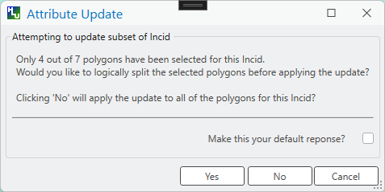

	Attribute Update Warning Dialog

.. raw:: latex

	\newpage

.. _function_split:

Split Features
==============

Features can be split logically or physically depending upon the filter active in the tool. If one or more features from a single INCID are present in the current filter then the tool will allow a logical split to be performed. If two or more fragments from the same INCID and with the same Fragment ID are present in the current filter then the tool will allow a physical split to be performed.

.. raw:: latex

	\newpage

.. index::
	single: Split Features; Logical Split

.. _function_logical_split:

Logical Split
-------------

Logical split is used to create a new INCID in the database based upon a subset of features selected from a single INCID in the GIS layer. Logically splitting one or more features assigns them to a different INCID than the other features in the current INCID which then allows them to be updated independently of the remaining features in the original INCID.

	.. note::
		All selected features must belong to the same INCID.

To perform a logical split:

* Select the subset of features to be split in the GIS layer as shown in the **right** part of the figure :ref:`figFLSFD`.
* Click |getmapselection| :guilabel:`Get Map Selection`.
* Click |split| :guilabel:`Split` and then |logicalsplit| :guilabel:`Logical Split`. A new INCID will be created and displayed as the current record and details of the split will be added to the History tab for the INCID.

.. _figFLSFD:

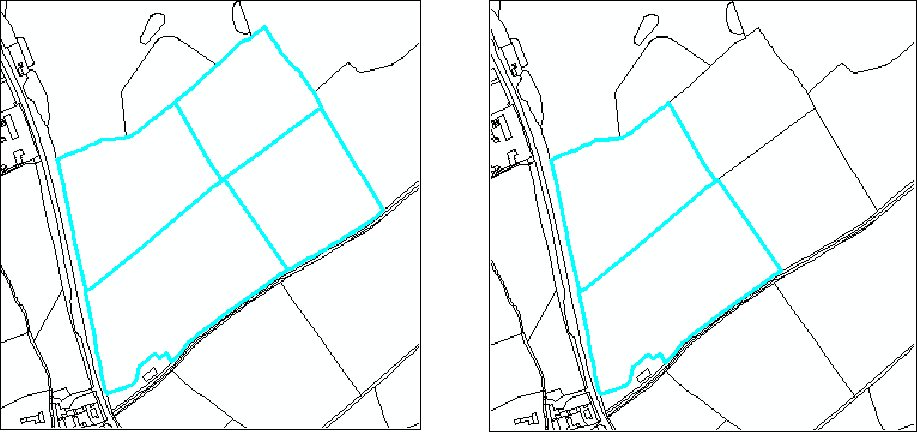

	Logical Split – Before (left) and After (right)

To display all the features in the INCID of a given feature:

* Select the feature of interest in the GIS layer.
* Click |getmapselection| :guilabel:`Get Map Selection`.
* Click |selectonmap| :guilabel:`Select Current INCID on Map`.

All the features associated with the current INCID will be displayed as shown in the **left** part of the figure :ref:`figFLSFD`.

.. raw:: latex

	\newpage

.. index::
	single: Split Features; Physical Split

.. _function_physical_split:

Physical Split
--------------

Physical split is used to create one or more new fragments in the database based upon a single feature that has already been split in the ArcGIS Pro map. Physically splitting a feature into fragments allows the fragments to be updated independently of each other (once they have also been assigned to different INCIDs - see :ref:`logical_split`.)

.. note::

	* Only one feature should be split in a single operation. Splitting multiple features will cause database synchronisation issues.
	* If several features have been split, select the fragments for one original feature and split using the tool. Repeat this operation for the remaining features.
	* Ensure that the physical split is completed in the database prior to commencing any other operations to avoid database synchronisation issues.
	* Physical split is not available for **point** layers.

.. tip::
	If two or more fragments from the same INCID and with the same Fragment ID are selected in the map and **Get Map Selection** is clicked then the tool will recognise that the fragments must have been split in the map and will inform the user that a physical split is possible.

To perform a physical split in ArcGIS Pro:

* Ensure the active HLU layer is editable.
* Select the feature to be split.
* On the HLU Tool ribbon click :guilabel:`Split` in the :ref:`map_tools_group` to activate the ArcGIS Pro Split tool, then draw a cut line through the feature.
* The feature will be split but both parts will remain selected as shown in the figure :ref:`figFArcSFD`. At this stage both features will still have the same fragment ID.

.. _figFArcSFD:

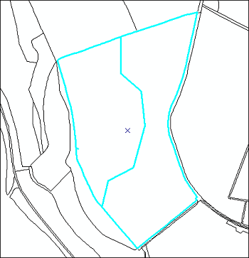

	Split Features

* Click |getmapselection| :guilabel:`Get Map Selection`.
* Click |split| :guilabel:`Split` and then |physicalsplit| :guilabel:`Physical Split`. A new fragment identifier will be assigned to one of the fragments and details of the split will be added to the History tab for the INCID.

.. raw:: latex

	\newpage

.. _function_merge:

Merge Features
==============

Merge features will performs two types of merge depending upon the filter active in the tool. If two or more features from multiple INCIDs are present in the current filter then the tool will allow a logical merge to be performed. If two or more fragments from the same INCID and with different Fragment IDs are present in the current filter then the tool will allow a physical merge to be performed.

.. index::
	single: Merge Features; Logical Merge

.. _function_logical_merge:

Logical Merge
-------------

Logical merge combines all the features selected in the GIS into a single INCID to be chosen from the selected features. This assigns the attributes from the chosen INCID to all the other selected features and logically groups the features into a single INCID so that they can be updated together in the future.

To perform a logical merge:

* Select the features to be merged in the map.
* Click |getmapselection| :guilabel:`Get Map Selection`.
* Click |merge| :guilabel:`Merge` and then |logicalmerge| :guilabel:`Logical Merge`. A list of INCIDs will be displayed as shown in the figure :ref:`figFLMD`.

.. _figFLMD:

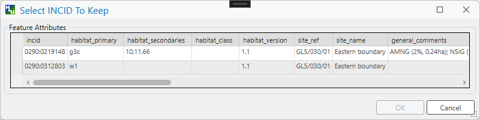

	Select INCID to Keep Dialog

* Click on the row to chose the INCID that the other features will be merged with. Any features for the selected INCID will be flashed in the map.
* Click :guilabel:`OK`. The other selected features in the map will be assigned to the chosen INCID and details of the merge will be added to the History tab for the INCID.

.. note::
	If the merged features are all fragments of the same INCID then a message will be displayed informing the user that a physical merge is possible.

.. raw:: latex

	\newpage

.. index::
	single: Merge Features; Physical Merge

.. _function_physical_merge:

Physical Merge
--------------

Physical merge combines fragments of a single feature, that are associated with the same INCID, into a single larger feature in the GIS layer. As the fragments must already belong to the same INCID there are no attribute updates but any shared boundaries between adjacent features will be removed.

.. note::

	* Only fragments belonging to the same INCID can be merged in a single physical merge operation.
	* If fragments for several groups need to be merged, the operation must be repeated for each group.
	* Physical merge is not available for **point** layers.

To perform a physical merge:

* Select two or more fragments from the same INCID in the map as shown in the **left** part of the figure :ref:`figFPMD`.
* Click |getmapselection| :guilabel:`Get Map Selection`.
* Click |merge| :guilabel:`Merge` and then |physicalmerge| :guilabel:`Physical Merge`. The features will be combined in the map as shown in the **right** part of the figure :ref:`figFPMD` and details of the merge will be added to the History tab for the INCID.

.. _figFPMD:

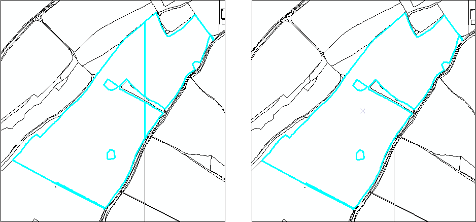

	Physical Merge - Before (left) and After (right)

.. raw:: latex

	\newpage

.. _function_insert_feature:

Insert Feature
==============

The **Insert Feature** function is used to register newly drawn GIS features — features that exist in the active HLU layer but have not yet been assigned an INCID — against new database records. Two modes are available depending on whether the drawn features represent a single habitat record or multiple independent records.

Before using either mode:

* Ensure the active HLU layer is editable in ArcGIS Pro.
* Create one or more new features in the active HLU layer using the standard ArcGIS Pro editing tools. The new features will initially have no INCID assigned.
* Optionally, populate the ``habprimary``, ``habsecond``, ``determqty`` and/or ``interpqty`` attribute columns on the new features before selecting them (see :ref:`function_insert_feature_gis_attributes` for details).
* Select the new features in the map.
* Ensure that a **Reason** and **Process** have been selected in the :ref:`updates_group` of the HLU Tool ribbon.

.. note::
	Both buttons in the **Feature Insert** group are disabled unless all selected features have no INCID assigned. If any selected feature already has an INCID the buttons will remain disabled.

.. index::
	single: Insert Feature; Same INCID

.. _function_insert_feature_same_incid:

Same INCID
----------

Registers all selected new features under a single new INCID. Each feature is assigned a unique fragment identifier within that INCID. Use this when the drawn features represent multiple fragments of the same habitat record.

.. note::
	All features being inserted under the **Same INCID** mode must carry identical values in the ``habprimary``, ``habsecond``, ``determqty`` and ``interpqty`` GIS columns. If any feature has different attribute values the insert will be cancelled and an error message will appear. Correct the attribute values or use **Separate INCIDs** mode instead.

To insert new features under the same INCID:

* Draw and select the new features in the active HLU layer as described above.
* Click |insertfeaturesameincid| :guilabel:`Same INCID` from the **Insert Feature** drop-down in the :ref:`feature_insert_group` of the HLU Tool ribbon.
* A new INCID will be created and all selected features will be registered against it with sequential fragment identifiers. The new INCID will be displayed as the current record in the dockpane and details of the insert will be added to the History tab.

.. seealso::
	See :ref:`feature_insert_group` for toolbar details.

.. index::
	single: Insert Feature; Separate INCIDs

.. _function_insert_feature_separate_incids:

Separate INCIDs
---------------

Registers each selected new feature under its own individual new INCID. Use this when each drawn feature represents a distinct, independent habitat record.

To insert new features each under a separate INCID:

* Draw and select the new features in the active HLU layer as described above.
* Click |insertfeatureseparateincid| :guilabel:`Separate INCIDs` from the **Insert Feature** drop-down in the :ref:`feature_insert_group` of the HLU Tool ribbon.
* A new INCID will be created for each selected feature. The first new INCID will be displayed as the current record in the dockpane and details of all inserts will be added to the History tab.

.. seealso::
	See :ref:`feature_insert_group` for toolbar details.

.. index::
	single: Insert Feature; GIS Attribute Columns

.. _function_insert_feature_gis_attributes:

GIS Attribute Columns
---------------------

The HLU layer supports a set of optional attribute columns that can be pre-populated before registering new features. When present and populated, the values are read from the GIS layer and used to initialise the corresponding database attributes for the new INCID record, reducing the amount of manual data entry required afterwards.

The following columns are recognised:

.. tabularcolumns:: |L|L|L|

.. table:: GIS attribute columns read during Feature Insert

	+-------------+---------------------------------+--------------------------------------------------------------+
	| GIS Column  | Attribute                       | Notes                                                        |
	+=============+=================================+==============================================================+
	| habprimary  | Primary Habitat code            | Must be a valid UKHab primary code for the                   |
	|             |                                 | active layer geometry type (polygon, line or                 |
	|             |                                 | point).                                                      |
	+-------------+---------------------------------+--------------------------------------------------------------+
	| habsecond   | Secondary Habitat code(s)       | One or more secondary codes, separated by                    |
	|             |                                 | spaces, commas or full-stops. Each code must be              |
	|             |                                 | a valid secondary code for the active layer                  |
	|             |                                 | geometry type. Cannot be provided without a                  |
	|             |                                 | valid primary code.                                          |
	+-------------+---------------------------------+--------------------------------------------------------------+
	| determqty   | Determination Quality           | Must be a recognised determination quality code              |
	|             |                                 | (see :ref:`function_insert_feature_determination_quality`).  |
	+-------------+---------------------------------+--------------------------------------------------------------+
	| interpqty   | Interpretation Quality          | Must be a recognised interpretation quality code             |
	|             |                                 | (see :ref:`function_insert_feature_interpretation_quality`). |
	+-------------+---------------------------------+--------------------------------------------------------------+

All four columns are **optional**. If a column is absent from the GIS layer, or its value is left blank, the corresponding attribute is simply left unpopulated in the new INCID record.

.. note::
	A secondary habitat code (``habsecond``) cannot be provided without a valid primary habitat code (``habprimary``). If a secondary code is supplied without a valid primary code it will be silently ignored.

.. _function_insert_feature_validation:

Validation
----------

Before the attributes are written to the database the tool validates each value:

* The **primary habitat code** is checked to ensure it is a recognised UKHab code applicable to the geometry type of the active layer. An unrecognised or geometry-incompatible code is treated as if no primary code was supplied.
* Each **secondary habitat code** is checked individually against the list of codes valid for the active layer geometry type. Any unrecognised or inapplicable code is silently discarded; only the remaining valid codes are used.
* The **determination quality** and **interpretation quality** codes are each checked against their respective lookup tables. An unrecognised code is treated as if no value was supplied.

.. _function_insert_feature_gis_update:

GIS Column Update on Success
----------------------------

After a successful insert, the tool writes back to the GIS layer to ensure the attribute columns reflect only the values that were actually stored in the database. Any value that failed validation is replaced with a blank in the GIS layer. The ``habsecond`` column is rewritten as a delimiter-separated list containing only the secondary codes that were accepted; discarded codes are removed.

This write-back ensures that the GIS layer remains consistent with the database and prevents stale or invalid attribute values being left in the layer.

.. _function_insert_feature_determination_quality:

Determination Quality Values
----------------------------

.. tabularcolumns:: |L|L|

.. table:: Valid Determination Quality codes

	+------+----------------------------------------------------------+
	| Code | Description                                              |
	+======+==========================================================+
	| DI   | Definitely is this habitat                               |
	+------+----------------------------------------------------------+
	| HI   | Habitat is in polygon, but not accurately mappable       |
	+------+----------------------------------------------------------+
	| HP   | Habitat probably in polygon, but not accurately mappable |
	+------+----------------------------------------------------------+
	| PI   | Probably is, but some uncertainty                        |
	+------+----------------------------------------------------------+
	| NP   | Not present but close to definition                      |
	+------+----------------------------------------------------------+
	| PP   | Previously present, but may no longer exist              |
	+------+----------------------------------------------------------+

.. _function_insert_feature_interpretation_quality:

Interpretation Quality Values
-----------------------------

.. tabularcolumns:: |L|L|

.. table:: Valid Interpretation Quality codes

	+------+-------------+
	| Code | Description |
	+======+=============+
	| G1   | Good        |
	+------+-------------+
	| A1   | Average     |
	+------+-------------+
	| P1   | Poor        |
	+------+-------------+
	| H1   | High (1)    |
	+------+-------------+
	| M2   | Medium (2)  |
	+------+-------------+
	| M3   | Medium (3)  |
	+------+-------------+
	| M4   | Medium (4)  |
	+------+-------------+
	| L5   | Low (5)     |
	+------+-------------+
	| L6   | Low (6)     |
	+------+-------------+
	| L7   | Low (7)     |
	+------+-------------+

.. _function_insert_feature_post_insert:

Completing Attributes After Insert
-----------------------------------

The Feature Insert operation creates a minimal INCID record using only the attributes that could be read from the GIS layer columns. The new record will typically require further editing in the dockpane to complete all required and recommended attributes. After inserting, navigate to the new INCID and review the following sections:

* **Primary and Secondary Habitats** (:ref:`habitats_tab`) — confirm or add the primary and secondary UKHab codes, and check that any automatically added priority habitats are correct and attributed with the correct determination and interpretation quality values.
* **Priority Habitats** (:ref:`priority_tab`) — review and complete any priority habitat and potential priority habitat entries, including their determination and interpretation quality values.
* **Boundary and Digitisation** — the boundary base map and digitisation base map values default to 'Unknown' but should be updated to reflect the source of the spatial data for the new feature(s).
* **Site Reference and Name** — enter the site reference and site name if known.
* **Condition Details** — add condition assessment information if available.
* **General Comments** — add any free-text comments relevant to the new feature(s).
* **Sources** (:ref:`details_tab`) — add one or more habitat survey sources to document the origin of the habitat information.

.. raw:: latex

	\newpage

.. index::
	see: Filter by Attributes; Advanced Query Builder

.. _filter_by_attributes:

Filter by Attributes
====================

Users can select which subset of INCID records are available for display in the dockpane, and correspondingly which features are selected in the active HLU layer, by applying a filter. The filter is performed by building a SQL query that selects one or more INCIDs based on a chosen set of criteria, or by entering a single INCID value using the **Find Incid** text box in the :ref:`filter_group`.

.. index::
	single: Filter; Advanced Query Builder

Advanced Query Filter
---------------------

.. _figFAQB:

.. figure:: figures/AdvancedQueryBuilder.png
	:align: center

	Advanced Query Builder Window

To apply a filter using the advanced query filter:

* Click |filterbyattr| **Filter by Attributes** in the :ref:`filter_group` of the HLU Tool ribbon to open the Advanced Query Builder window.
* Select a Table in the list and click :guilabel:`Add` to add it to the 'SELECT DISTINCT incid FROM' field and WHERE field.
* Select a Column, Operator and Value in a similar way to build up a SQL clause.
* Add further criteria as required by selecting values and adding them to the SQL clause.
* Click :guilabel:`Verify` to check that the SQL clause is valid. A warning message explaining the error will appear if not.
* Click :guilabel:`OK`. The query will be executed and the resulting INCIDs will be selected in the dockpane.

.. note::
	The last query executed will appear next time the Advanced Query Builder window is opened (whilst the tool remains running).

To **save** an advanced query:

* Click |filterbyattr| **Filter by Attributes** to open the Advanced Query Builder window.
* Create a valid query as above.
* Before executing the query click :guilabel:`Save`. A save dialog will open prompting you to select a folder and file name.
* Select a destination folder, enter a suitable file name and click :guilabel:`Save`. The query will be saved.

To **load** a previously saved advanced query:

* Click |filterbyattr| **Filter by Attributes** to open the Advanced Query Builder window.
* Click :guilabel:`Load`. A load dialog will open prompting you to select an existing SQL query (.hsq) file.
* Select the required file and click :guilabel:`Open`.
* The query will be loaded into the query window. It can now be verified and then executed.

.. raw:: latex

	\newpage

.. index::
	single: Filter; Filter by Incid

.. _filter_by_incid:

Filter by Incid
---------------

.. _figFFBI:

.. figure:: figures/FilterByIncid.png
	:align: center

	Filter By Incid Window

To filter by a single INCID:

* Enter or paste a valid INCID into the **Find Incid** text box in the :ref:`filter_group` of the HLU Tool ribbon and press :kbd:`Enter`. The INCID will be selected in the dockpane.

.. raw:: latex

	\newpage

.. index::
	single: Select; Select INCIDs

.. _select_incids:

Select INCIDs
=============

Users can select features in the active HLU layer based on the current INCID filter, or load INCID records into the dockpane based on a map selection, using the buttons in the :ref:`selection_group` of the HLU Tool ribbon.

.. index::
	single: Select; Get Map Selection

.. _get_map_selection:

Get Map Selection
-----------------

To filter the database records based on features selected in the map:

* Select one or more features in the active HLU layer in ArcGIS Pro.
* Click |getmapselection| :guilabel:`Get Map Selection`. The INCID records associated with the selected features will be loaded into the dockpane and the number of selected features for the current INCID will be shown in the INCID Status section.

.. tip::
	If features from more than one INCID are selected, all associated INCID records will be loaded into the active filter and can be browsed using the navigation buttons. Click |selectonmap| :guilabel:`Select Current INCID` to expand the selection to include all features belonging to the current INCID.

.. index::
	single: Select; Select current INCID

.. _select_current_incid:

Select Current INCID
--------------------

To select all features associated with the current INCID in the active HLU layer:

* Click |selectonmap| :guilabel:`Select Current INCID on Map`. All features for the current INCID will be selected in the active HLU layer.

.. note::
	Depending on the **Warn Before Selecting Features** setting in the GIS Options (see :ref:`options_gis`), a warning message may appear before executing the query if the expected number of features to be selected exceeds the configured threshold.

.. index::
	single: Select; Select all filtered INCIDs

.. _select_all_filtered_incids:

Select All Filtered INCIDs
--------------------------

To select all features associated with every INCID in the active filter:

* Apply a filter using :ref:`filter_by_attributes` or select features in the map and click |getmapselection| :guilabel:`Get Map Selection`.
* Click |selectallonmap| :guilabel:`Select All Filtered INCIDs`. All features associated with every INCID in the active filter will be selected in the active HLU layer.

.. warning::
	This process may take a long time depending upon the number of INCIDs in the active filter and the size of the HLU layer. Depending on the **Warn Before Selecting Features** setting in the GIS Options (see :ref:`options_gis`), a warning message will appear before the selection is made, as shown in the figure :ref:`figFGSWD`, if the expected number of features to be selected exceeds the configured threshold.

.. _figFGSWD:

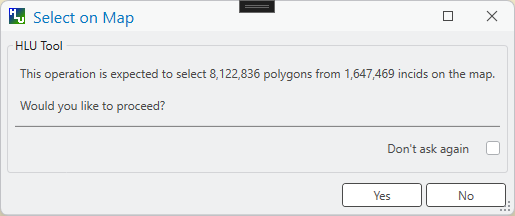

	GIS Selection Warning Dialog

.. index::
	single: Select; Auto Select

.. _auto_select:

Auto Select
-----------

The |autoselect| :guilabel:`Auto Select` button in the :ref:`selection_group` of the HLU Tool ribbon toggles automatic selection of all features associated with the current INCID in the active HLU layer whenever the INCID changes in the dockpane.

When **Auto Select** is active:

* Moving to a different INCID using the navigation buttons, or entering a record number directly in the INCID Status section, will automatically select all features associated with that INCID in the active HLU layer.
* The button appears highlighted to indicate that auto-selection is enabled.

When **Auto Select** is inactive:

* Changing the current INCID in the dockpane does not change the map selection.
* Use |getmapselection| :guilabel:`Get Map Selection` or |selectonmap| :guilabel:`Select Current INCID on Map` to update the selection manually.

.. note::
	Depending on the **Warn Before Selecting Features** setting in the GIS Options (see :ref:`options_gis`), a warning message may appear before each automatic selection if the expected number of features to be selected exceeds the configured threshold.

.. raw:: latex

	\newpage

.. index::
	single: Bulk Updates; Apply
	single: Updates; Bulk Updates

.. _bulk_updates:

Bulk Updates
============

Users can update the attributes for multiple INCID records, and associated features in the active HLU layer, by performing a bulk update. Bulk updates can only be applied to a subset of INCID records by applying a filter. Attribute updates applied in bulk update mode will be applied to all INCIDs in the active filter.

.. warning::
    Bulk updates will only apply changes to selected features in the active HLU layer. So, in the event that some fragments for the selected INCID records are in more than one layer, only the features in the active layer will be updated. To avoid this scenario please ensure that all features for every incid are stored in the same HLU layer.

.. note::

    * Bulk update mode can only be started once a filter is applied to the INCID records and the active HLU layer is editable in ArcGIS Pro.
	* Bulk update mode is only available to configured users who have been given bulk update permissions. For details on configuring users see 'Lookup Tables' in the HLU Tool Technical Guide `readthedocs.org/projects/hlutool-arcpro-technicalguide <https://readthedocs.org/projects/hlutool-arcpro-technicalguide/>`_.

.. _figFUIBU:

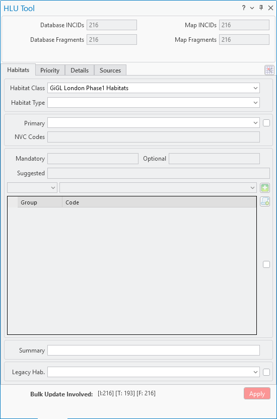

	Main window - Bulk Update Mode

.. raw:: latex

	\newpage

To bulk apply updates:

* Filter the database records using **Filter by Attributes** or select features in the map and click :guilabel:`Get Map Selection`. For details on filtering records see :ref:`filter_by_attributes`.
* Click |bulkupdate| :guilabel:`Bulk Update` in the :ref:`mode_group` of the HLU Tool ribbon to enter bulk update mode. An empty form is displayed as shown in the figure :ref:`figFUIBU` and the 'Bulk Update' section displays the number of INCIDs and fragments affected by the update.
* Enter the update details in the Habitats, Priority, Details, and Sources tabs, then click :guilabel:`Apply`. The Bulk Update confirmation window will appear as shown in the figure :ref:`figFUIBUC`.
* Select the required options for the bulk update and click :guilabel:`OK`. The INCIDs in the active filter will be updated.

.. _figFUIBUC:

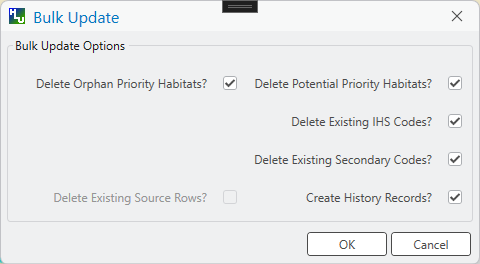

	Bulk Update Confirmation Window

.. warning::
	Bulk updates should be used with caution as unexpected results may occur if users do not understand the implications of any updates made or the options applied.

To cancel bulk update mode:

* Click |update| :guilabel:`Update` in the :ref:`mode_group` to return to normal Update mode.

.. raw:: latex

	\newpage

.. index::
	single: OSMM Updates; Review
	single: Updates; OSMM Updates, Review

.. _review_osmm_updates:

Review OSMM Updates
===================

If the habitat framework has been externally processed against a more recent OS MasterMap (OSMM) update there may be proposed OSMM updates to review and apply. Proposed updates can either be skipped (so that they can be reviewed again later), accepted (when they become pending updates to be applied later) or rejected (so that they cannot be applied later). They can be reviewed one INCID at a time or all remaining INCIDs in the active filter can be rejected or accepted en-mass.

.. _figFUIOUF:

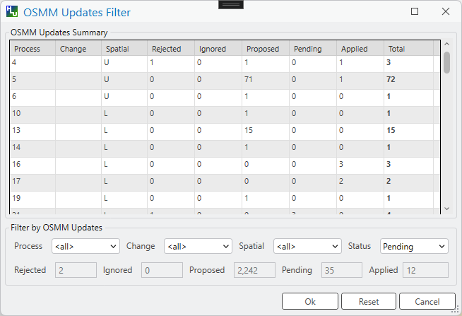

	Review OSMM Updates Filter Window

To filter proposed OSMM Updates:

* Click |osmmreview| :guilabel:`OSMM Review` in the :ref:`mode_group` of the HLU Tool ribbon to enter Review OSMM Update mode. The OSMM Updates Filter window will appear as shown in figure :ref:`figFUIOUF`.
* Select a row in the table or manually select the required values for any or all of the Process, Change, Spatial and Status fields.
* Click :guilabel:`Ok` to apply the selected filter to the INCID records in the dockpane.

.. note::
			To apply another filter at any time click |filterbyattr| **Filter by Attributes** in the :ref:`filter_group` to re-open the OSMM Updates Filter window.

	.. _figFUIOU:

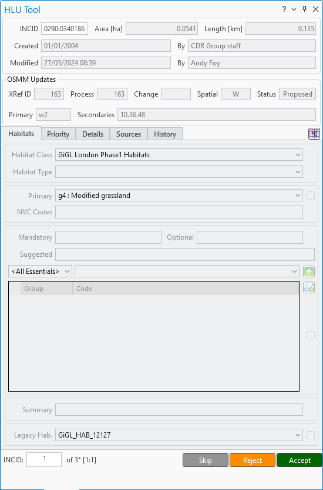

	Review OSMM Updates Window

.. raw:: latex

	\newpage

To process proposed OSMM Updates:

* Once a filter has been applied the main interface appears as shown in the figure :ref:`figFUIBOU` and the 'Bulk Update' section displays the number of INCIDs and fragments that will be affected by the update.
* Click :guilabel:`Skip` to skip the proposed update for the current INCID. It can then be reviewed again at a later time.
* Click :guilabel:`Reject` to reject the proposed update for the current INCID. It will no longer be available for reviewing or applying.
* Click :guilabel:`Accept` to accept the proposed update for the current INCID. The update will now be 'Pending' and must be applied by bulk applying OSMM Updates (see :ref:`bulk_osmm_update` for details).
* Click :guilabel:`Adopt` to accept the proposed update for the current INCID **and** immediately apply it in a single step, without needing to perform a separate bulk apply operation.

.. note::
	Holding down the :guilabel:`Ctrl` key changes the :guilabel:`Reject` and :guilabel:`Accept` buttons to :guilabel:`Reject All` and :guilabel:`Accept All` thereby allowing the user to Reject or Accept all remaining INCIDs in the active filter.

Once all the INCIDs in the active filter have been processed a message will appear as shown in figure :ref:`figFUIOUW`. The user can apply another filter or cancel the review OSMM Updates mode.

.. _figFUIOUW:

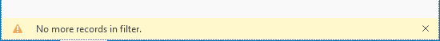

	Review OSMM Updates - No more records found

To cancel Review OSMM Updates mode:

* Click |update| :guilabel:`Update` in the :ref:`mode_group` to return to normal Update mode.

.. raw:: latex

	\newpage

.. index::
	single: OSMM Updates; Bulk Apply
	single: Updates; OSMM Updates, Bulk Apply

.. _bulk_osmm_update:

Bulk Apply OSMM Updates
=======================

Once proposed OSMM updates have been accepted they become 'Pending' and must be bulk processed in order to apply them.

.. warning::
    As with Bulk updates, OSMM Bulk updates will only apply changes to selected features in the active HLU layer. So, in the event that some fragments for the selected INCID records are in more than one layer, only the features in the active layer will be updated. To avoid this scenario please ensure that all features for every incid are stored in the same HLU layer.

.. note::

	* Bulk apply OSMM update mode can only be started when the active HLU layer is editable in ArcGIS Pro.
	* Bulk apply OSMM update mode is only available to configured users who have been given bulk update permissions. For details on configuring users see 'Lookup Tables' in the HLU Tool Technical Guide `readthedocs.org/projects/hlutool-arcpro-technicalguide <https://readthedocs.org/projects/hlutool-arcpro-technicalguide/>`_.

.. _figFUIBOUF:

	Bulk Apply OSMM Updates Filter Window

To filter pending OSMM Updates:

* Click |osmmBulkupdate| :guilabel:`OSMM Bulk Update` in the :ref:`mode_group` of the HLU Tool ribbon to enter Bulk OSMM Update mode. The OSMM Updates Filter window will appear as shown in figure :ref:`figFUIBOUF`.
* Select a row in the table or manually select the required values for any or all of the Process, Change, Spatial and Status fields.
* Click :guilabel:`Ok` to apply the selected filter to the INCID records in the dockpane.

.. note::
			To apply another filter at any time click |filterbyattr| **Filter by Attributes** in the :ref:`filter_group` to re-open the OSMM Updates Filter window.

	.. _figFUIBOU:

.. figure:: figures/UserInterfaceBulkOSMMUpdate.png
	:align: center
	:scale: 60

	Bulk OSMM Update Window

.. raw:: latex

	\newpage

To bulk apply OSMM updates:

* Once a filter has been applied an empty form is displayed as shown in the figure :ref:`figFUIBOU` and the 'Bulk Update' section displays the number of INCIDs and fragments that will be affected by the update.
* The Habitats tab will be disabled as changes to the habitat attributes are determined by the pending OSMM update for each INCID.
* Enter any required update details in the Details and Sources tabs, then click :guilabel:`Apply`. The Bulk Update confirmation window will appear as shown in the figure :ref:`figFUIBOUC`.
* Select the required options for the bulk update and click :guilabel:`OK`. The INCIDs in the active filter will be updated.

.. _figFUIBOUC:

	Bulk Update Confirmation Window

.. note::
	If a default OSMM Source Name has been set (see :ref:`options_bulk_update` for details) this will automatically appear in the Sources tab.

.. warning::
	Performing bulk OSMM updates should be used with caution as unexpected results may occur if users do not understand the implications of any update details or the options applied.

To cancel Bulk Apply OSMM Updates mode:

* Click |update| :guilabel:`Update` in the :ref:`mode_group` to return to normal Update mode.

.. raw:: latex

	\newpage

.. index::
	single: Exports

.. _export_function:

Exports
=======

Exporting allows users to combine spatial geometries from a HLU GIS layer and attribute data from the HLU database into a combined GIS layer using a pre-defined export format.

.. _figFED:

.. figure:: figures/ExportDialog.png
	:align: center

	Export Window

To perform an export:

	* Select the required INCID and GIS features to be exported (either by selecting the features in the map and clicking :guilabel:`Get Map Selection`, or by performing a **Filter by Attributes**) and then clicking :guilabel:`Select All Filtered INCIDs`.
	* Click |export| **Export** in the :ref:`export_group` of the HLU Tool ribbon to open the Export window.
	* Select one of the pre-defined export formats from the 'Export Format' drop-down list.
	* Select the required output format in the 'Output Type' drop-down list.
	* Tick the 'Selected only' checkbox to export **only** the selected features or clear the checkbox to export **all** of the features in the active HLU layer as required.

	.. note::
		If a filter is active based on the features selected in the active HLU layer then the 'Selected only' checkbox is automatically ticked and the number of selected features is shown (as seen in :ref:`figFED`). Only the selected INCIDs and associated features will be exported. Untick this checkbox to export all records. For details on how to filter records see :ref:`filter_by_attributes`.

	* Click :guilabel:`Ok` to start the export. Select a destination folder and suitable file name for the new GIS layer when prompted.
	* A pop-up message will appear informing when the export has completed and informing the user that the exported layer has been loaded to the active ArcGIS Pro map.

.. note::
	The default export folder destination can be set in the Export Options (see :ref:`options_export` for more details).

.. warning::
	Exporting all features or a large number of features can take a long time depending upon the number of features and the configuration of the HLU Tool and database system.

During the export process checks and validation are performed to avoid potential errors. The selected export format is validated before the export begins — if no valid format is selected an error will be shown and the export will not proceed. A warning may also appear if the export contains a large number of INCIDs and hence may take a long time to complete, or if a shapefile export format is used and the format contains field names that exceed 10 characters (as this will result in the field names being automatically truncated or renamed by ArcGIS Pro).

.. seealso::
	For details on defining export formats see 'Configuring Exports' in the HLU Tool Technical Guide at `readthedocs.org/projects/hlutool-arcpro-technicalguide <https://readthedocs.org/projects/hlutool-arcpro-technicalguide/>`_.
