.. |filterbyattr| image:: ../icons/FilterByAttributes.png
	:height: 16px
	:width: 16px

.. |export| image:: ../icons/FileExport.png
	:height: 16px
	:width: 16px

**********
Interfaces
**********

.. index::
	see: Interfaces; Windows
	single: Windows; Main Window

.. _main_window:

Main Window
===========

Once the HLU Tool add-in has been installed, clicking the :guilabel:`HLU Tool` button on the ArcGIS Pro 'Tool' ribbon will load the HLU Tool dockpane as shown in the figure :ref:`figUIMW`. It will also add the 'HLU Tool' ribbon which will appear whenever the tool is loaded.

.. _figUIMW:

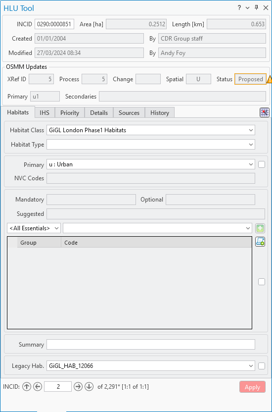

	Main Window

.. raw:: latex

	\newpage

Records can be viewed or updated through the HLU Tool dockpane. Missing or invalid fields are highlighted in red and the relevant tab will also be highlighted. The 'Apply' button will be active when edit mode is active, when a reason and process have been selected in the ribbon, and when all required fields have been completed and are valid on all dockpane tabs.

The following sections summarise the different sections of the dockpane.

.. _figUITB:

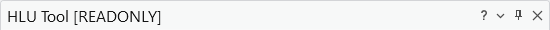

	Main Window - Dockpane Title Bar

.. note::
	The dockpane header displays **[READONLY]** when the tool is in read-only mode, as shown in the figure :ref:`figUITB`. See 'Why does the tool show [READ ONLY]?' in :doc:`FAQ <../faq/faq>` for more information.

.. _incid_section:

INCID Section
-------------

The 'INCID' section displays summary information for each INCID in the database, including area, perimeter, date created and date last modified as shown in the figure :ref:`figUIIS`.

.. _figUIIS:

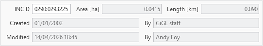

	Main Window - INCID Section

INCID
	The unique reference for the current record.

Area
	The total area of all the selected features for the current INCID. Displayed in the units configured in :ref:`options_gis`. For line layers this field shows the total length. Not shown for point layers.

Length
	The total perimeter length of all the selected features for the current INCID. Displayed in the units configured in :ref:`options_gis`. Not shown for point layers.

Created/By
	The date the current INCID was first created and the name of the user that created it. For most INCIDs this will relate to when the data was first loaded into the framework. For INCIDs that have been created as a result of a logical split this relate to when the split was performed.

Modified/By
	The date the current INCID was last modified and the name of the user that modified it. If the INCID has not been modified this will correspond with when the data was first loaded into the framework.

.. tip::
	The displayed INCID value can be copied to the clipboard by selecting the value and then either right-clicking in the field and selecting **Copy** or pressing :kbd:`Ctrl-C`.

.. note::
	If the created or modified users are not configured, the 'By' fields will display their Windows login instead of their user name. For details on configuring users see 'Lookup Tables' in the HLU Tool Technical Guide at `readthedocs.org/projects/hlutool-arcpro-technicalguide <https://readthedocs.org/projects/hlutool-arcpro-technicalguide/>`_.

.. raw:: latex

	\newpage

.. _osmm_update_section:

OSMM Updates Section
--------------------

The 'OSMM Updates' section displays summary information of any proposed or pending OSMM updates for each INCID in the database, including the update process flag, change flag, spatial flag, status and proposed new primary and secondary codes as shown in the figure :ref:`figUIOUS`.

.. note::
	If/when the OSMM Update section appears can be configured in the user options. For details see :ref:`options_interface`.

.. _figUIOUS:

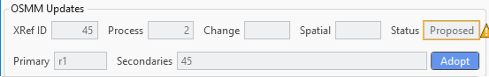

	Main Window - OSMM Updates Section

For a description of the fields see :ref:`review_osmm_section`.

When an INCID has a pending OSMM update (i.e. the status is 'Pending') an :guilabel:`Adopt` button is displayed at the bottom of the OSMM Updates section.

.. note::
	The :guilabel:`Adopt` button is only available when the active HLU layer is editable in ArcGIS Pro, the user has bulk update permissions, and the current INCID has a pending OSMM update.

	Clicking :guilabel:`Adopt` immediately applies the primary and secondary habitat codes from the pending OSMM update to the current INCID without needing to enter OSMM Bulk Update mode.

.. note::
	The user still needs to save the changes to the current INCID before the update is applied. The OSMM status is only changed from 'Pending' to 'Applied' after a successful save.

.. raw:: latex

	\newpage

.. _habitats_tab:

Habitats Tab
------------

Click on the :guilabel:`Habitats` tab to display the Habitats tab as shown in
the figure :ref:`figUIHT`.

.. _figUIHT:

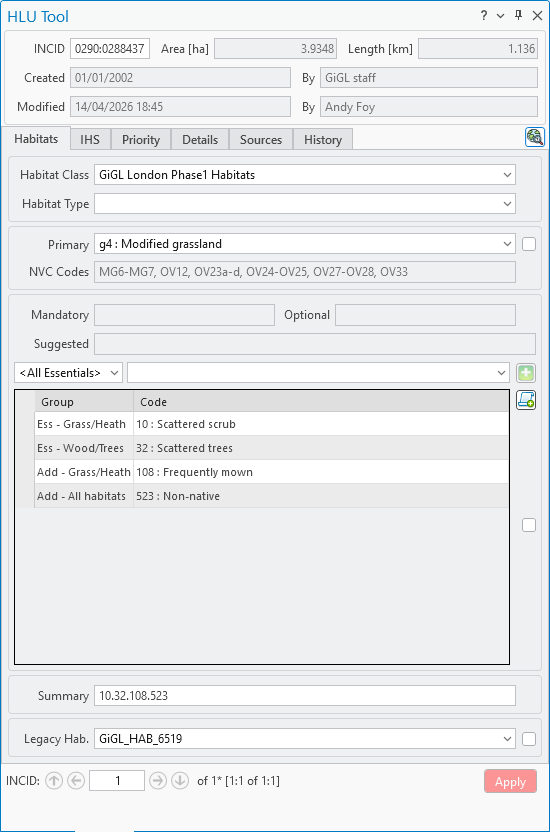

	Main Window - Habitats Tab

The Habitats tab displays the primary and secondary codes and the legacy habitat for the current INCID record. It also assists attribute updates when the original survey source(s) are based on a different classification system by providing translations from a range of habitat classifications (e.g. JNCC Phase 1, IHS and NVC).

.. raw:: latex

	\newpage

.. _habitats_classification_overview:

Understanding the Habitat Classification System
~~~~~~~~~~~~~~~~~~~~~~~~~~~~~~~~~~~~~~~~~~~~~~~

The Habitats tab is used to describe the habitat of each INCID. There are
two components to defining the habitat of each INCID record:

2. **Primary Habitat** — the single main habitat code assigned to
   the INCID. Selected using the **Primary** drop-down list.
3. **Secondary Habitats** — one or more additional codes that
   refine or qualify the primary habitat. Added using the **Group**,
   **Code** drop-down lists and |addsh| button and stored in the secondary habitats
   table.

In addition, the tool provides assistance to users when the original survey
source(s) are not the same as the target habitat type by providing recommended
translations from a range of habitat classifications (e.g. JNCC Phase 1, IHS and
NVC).

The diagram below summarises how the levels relate to each other:

.. code-block:: none

	Habitat Class (source data)
	    └── Habitat Type (source data)
	            ├── Primary Habitat (one per INCID)
	            │       ├── NVC Codes         (read-only hint)
	            │       ├── Suggested Codes   (read-only hint)
	            │       └── Habitat Tips      (read-only hint)
	            └── Secondary Habitats (zero or more per INCID)
	                    ├── Mandatory secondary codes
	                    └── Optional secondary codes

.. note::
	Selecting a habitat class and then habitat type filters which
	primary codes are shown in the **Primary** drop-down list. Selecting
	a primary code then determines which secondary groups and codes are
	available, which codes are mandatory, and which are suggested.

.. note::
	The **Class** and **Type** selections themselves are **not** saved
	to the database — they are only used to assist code selection. Use
	the :ref:`source_tab` if you wish to record the source habitat
	classification and type.

**Mandatory and Optional secondary codes** are determined by the
selected habitat type (from the lookup tables). The **Suggested** codes
are an additional hint derived from the combination of the selected
habitat type and primary code, and represent codes commonly paired with
that primary habitat. Suggested codes are hints only — they do not
restrict which secondary codes can be selected.

.. tip::
	If no habitat classification translation is needed, the **Class**
	and **Type** drop-down lists can be hidden via **Show Source Habitat**
	in the :ref:`options_window`.

Class
	Drop-down list of habitat classifications used to filter the
	**Type** drop-down list to a specific habitat class. The contents
	in the list are based on entries in the lut_habitat_class
	table. [7]_

Type
	Drop-down list of habitat classification types used to filter the
	**Primary** drop-down list to relevant codes. The contents in the
	list are based on entries in the lut_habitat_type table that
	relate to the selected Class (above). [7]_

	.. note::
		The entries in these fields are only used to assist the user
		to select the most appropriate Primary codes. They are **not**
		saved to the database. Use Sources if you wish to record the
		source habitat classification and type in the database (see
		:ref:`source_tab` for more details).

.. [7] The habitat **Class** and **Type** list contents are based only
   on entries in the relevant lookup tables where the ``is_local`` flag
   is set to True (-1). See 'Lookup Tables' in the HLU Tool Technical
   Guide at
   `readthedocs.org/projects/hlutool-arcpro-technicalguide
   <https://readthedocs.org/projects/hlutool-arcpro-technicalguide/>`_
   for details of how to update lookup table entries.

Primary
	Drop-down list allowing users to select the desired primary
	code. The contents of the list will vary and relate directly to
	the selected Class and Type (above) and entries in the
	lut_habitat_type_primary table. [8]_

	Codes that are **preferred** for the selected habitat type are
	shown in **bold** at the top of the list, separated from the
	remaining valid codes by a divider line.

	.. note::
		The primary code list is filtered by the geometry type of the active HLU layer (polygon, line, or point) so that only codes applicable to that geometry type are shown.

NVC Codes
	[Read only]. Displays a list of any NVC Codes related to the
	primary code selected in the preceding drop-down list. This
	field can be displayed or hidden in the user options as required
	(see :ref:`options_window`).

Mandatory
	[Read only]. A comma-separated list of any secondary codes
	that **must** be added along with the selected primary habitat
	into the table below according to the official documentation.

	.. note::
		Missing mandatory secondary codes are flagged as warnings or
		errors depending on the validation settings (see :ref:`options_validation`).

Optional
	[Read only]. A comma-separated list of any secondary codes
	that **may optionally** be added along with the selected primary
	habitat.

Suggested
	[Read only]. A comma-separated list of any secondary codes
	that are **suggested** based on the selected source habitat type
	and the primary habitat. This field can be shown or hidden in the
	user options as required (see :ref:`options_window`).

	.. note::
		Suggested codes are hints only — they do not restrict which
		secondary codes can be selected or added.

Group
	Drop-down list allowing users to select a subset of secondary
	codes. The contents of the list will vary and relate directly to
	the selected primary habitat and entries in the
	lut_secondary_group and lut_primary_secondary tables. [8]_

	Selecting :guilabel:`<All>` shows all valid secondary codes for
	the current primary habitat regardless of group. Selecting
	:guilabel:`<All Essentials>` restricts the list to the most
	commonly used codes.

Code
	Drop-down list allowing users to select a secondary code. The
	contents of the list will vary and relate directly to the selected
	Group (above) and entries in the lut_secondary and
	lut_primary_secondary tables. [8]_

	.. note::
		The secondary code list is filtered by the geometry type of the active HLU layer (polygon, line, or point) so that only codes applicable to that geometry type are shown or valid.

Add Secondary Habitat
	A button to add the selected secondary code to the table below.
	Duplicate codes already in the table will be ignored.

Add Secondary Habitats from List
	A button to open a window allowing users to enter a list of secondary codes applicable to the
	current primary habitat, separated by commas, spaces or full stops, in one operation.

	.. note::
		Only secondary codes valid for the current primary code and for the geometry type of the active HLU layer (polygon, line, or point), and not already present in the table, are added from the list.

.. note::
	To delete an existing secondary habitat code click on the grey box to the left of the secondary habitat to select the row, then press the keyboard :kbd:`Delete` key to remove it.

Summary
	[Read only]. Automatically generated sorted and concatenated
	string of the primary and secondary codes present in the table above.
	This field can be shown or hidden in the user options as required
	(see :ref:`options_window`).

Legacy Habitat
	Drop-down list allowing users to view and maintain a legacy
	habitat definition (if required). The contents of the list are
	based on existing entries in the lut_legacy_habitat table.

.. [8] The primary and secondary group/code list contents are based
   only on entries in the relevant lookup tables where the ``is_local``
   flag is set to True (-1). See 'Lookup Tables' in the HLU Tool
   Technical Guide at
   `readthedocs.org/projects/hlutool-arcpro-technicalguide
   <https://readthedocs.org/projects/hlutool-arcpro-technicalguide/>`_
   for details of how to update lookup table entries.

.. raw:: latex

	\newpage

.. _ihs_tab:

IHS Tab
-------

Click on the :guilabel:`IHS` tab to display the IHS tab as shown in the figure :ref:`figUIIT`.

.. _figUIIT:

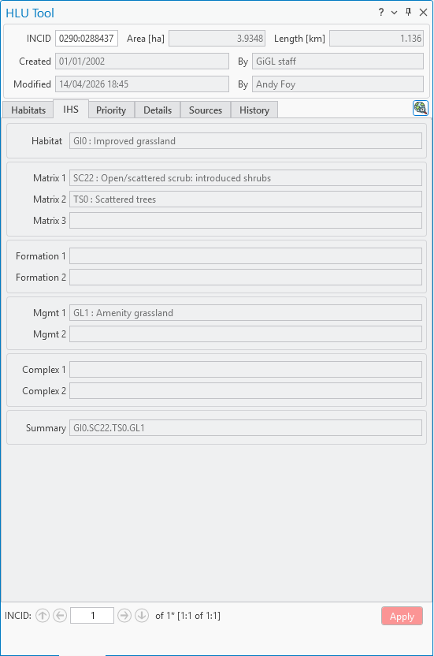

	Main Window - IHS Tab

The IHS tab displays the former Integrated Habitat System (IHS) details for the current INCID record. All fields are read only.

Habitat
	[Read only]. Displays the IHS Habitat code prior to conversion to UKHab.

IHS Matrix / Formation / Management / Complex
	[Read only]. Displays the IHS Matrix / Formation / Management / Complex codes prior to conversion to UKHab.

IHS Summary
	[Read only]. Concatenation of the above IHS habitat and multiplex codes.

.. note::
	The IHS details will be blank for features added since the conversion from IHS, or if the 'When To Clear IHS Codes After Update' option is set to clear when certain attribute updates are applied (see :ref:`options_updates`).

.. raw:: latex

	\newpage

.. _priority_tab:

Priority Tab
------------

Click on the :guilabel:`Priority` tab to display the Priority tab as shown in the figure :ref:`figUIPT`.

.. _figUIPT:

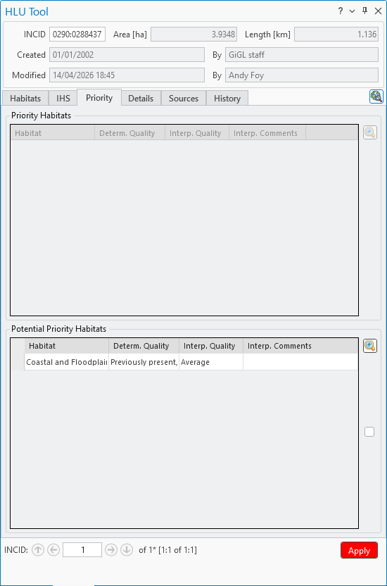

	Main Window - Priority Tab

The Details tab displays any priority and potential priority habitats for the current INCID.

.. raw:: latex

	\newpage

Priority Habitats
~~~~~~~~~~~~~~~~~
These are automatically added based upon the Habitat and multiplex codes selected on the :ref:`habitats_tab`. For new priority habitats, 'Determination Quality' and 'Interpretation Quality' must be entered.

Determination
	Drop-down list allowing the user to select the accuracy with which the priority habitat has been determined.

Interpretation
	Drop-down list allowing the user to select the quality of interpretation between the original survey source and the priority habitat, taking into account the age of the source data and the relationship between the source habitat classification and the priority habitat.

Interpretation Comments
	A free text field which allows the user to provide additional reasoning behind the habitat interpretation.

	Click |zoomtable| to open the Priority Habitats window.

Potential Priority Habitats
~~~~~~~~~~~~~~~~~~~~~~~~~~~
These are other priority habitats, as defined by users, that may also be present in the future given appropriate management or restoration. An INCID may have one or more potential priority habitats even if no priority habitats are present.

Determination
	Drop-down list allowing the user to select the accuracy with which the potential priority habitat has been determined.

Interpretation
	Drop-down list allowing the user to select the quality of interpretation between the original survey source and the potential priority habitat, taking into account the age of the source data and the relationship between the source habitat classification and the priority habitat.

Interpretation Comments
	A free text field which allows the user to provide additional reasoning behind the habitat interpretation.

	Click |zoomtable| to open the Potential Priority Habitats window.

.. note::
	To delete a potential priority habitat click on the grey box to the left of the potential priority habitat to select the row, then press the keyboard :kbd:`Delete` key to remove it.

.. raw:: latex

	\newpage

.. _details_tab:

Details Tab
-----------

Click on the :guilabel:`Details` tab to display the Details tab as shown in the figure :ref:`figUIDT`.

.. _figUIDT:

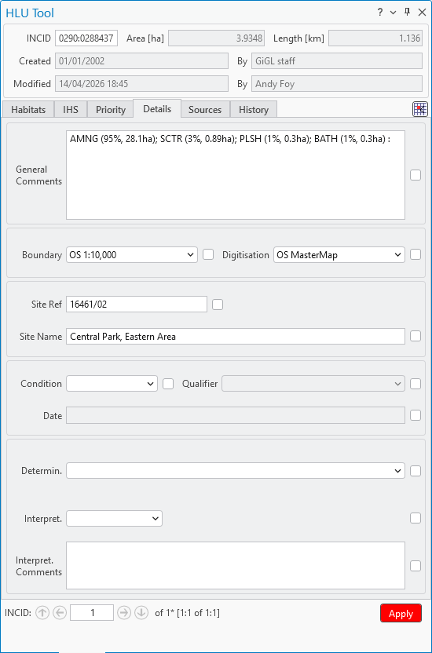

	Main Window - Details Tab

The Details tab displays any general comments, maps, site details, condition assessments and quality assessments.

.. raw:: latex

	\newpage

General Comments
	A free-text field which allows users to enter any additional comments up to 254 characters.

Boundary Map
	Drop-down list allowing users to select the map source used to define the boundary.

Digitisation Map
	Drop-down list allowing users to select the map source used to digitise the boundary.

Site Ref
	A free-text field which allows users to enter the reference code or key of the site containing the INCID features.

Site Name
	A free-text field which allows users to enter the name of the site containing the INCID features.

Condition
	Drop-down list allowing users to select a condition assessment of the habitat parcel or select 'Unknown' if not known.

	.. note::
		If a condition assessment has been selected, the 'Qualifier' and 'Date' fields must also be completed.

Qualifier
	Drop-down list allowing users to select a qualifier for how the condition assessment was determined.

Date
	Allows users to enter the date of the condition assessment.

Determination
	Drop-down list allowing the user to select the accuracy with which the primary and secondary habitats have been determined.

Interpretation
	Drop-down list allowing the user to select the quality of interpretation between the original survey source and the primary and secondary habitats, taking into account the age of the source data and the relationship between the source habitat classification and the primary and secondary codes.

Interpretation Comments
	A free text field which allows the user to provide additional reasoning behind the habitat interpretation.

.. raw:: latex

	\newpage

.. _source_tab:

Sources Tab
-----------

Click on the :guilabel:`Sources` tab to display the Sources tab as shown in the figure :ref:`figUIST`.

.. _figUIST:

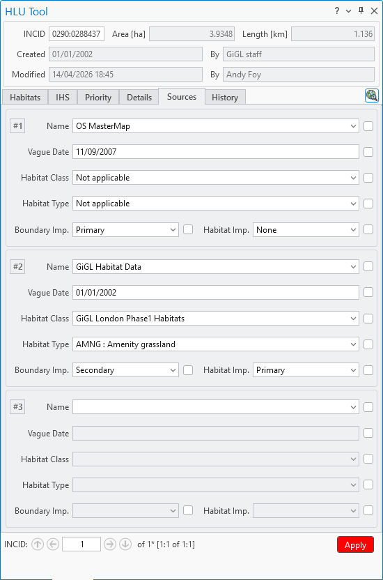

	Main Window - Sources Tab

The Sources tab shows any sources of information that were used to determine the habitat and boundary of all features relating to the current INCID, plus the priorities that were applied to each source. Up to three sources can be defined for each INCID.

.. raw:: latex

	\newpage

Name
	Drop-down list containing a list of data sources. For details on adding new sources see 'Lookup Tables' in the HLU Tool Technical Guide at `readthedocs.org/projects/hlutool-arcpro-technicalguide <https://readthedocs.org/projects/hlutool-arcpro-technicalguide/>`_.

.. note::
	The following source fields will not be unlocked until a source name has been selected.

Vague Date
	Allows users to enter the date of the data source. This can be either a precise date e.g. 01/04/2010 or a vague date e.g. Spring 2010-Summer 2010, 1980-2010 or 'Unknown'. For details on configuring vague dates see :ref:`options_dates`.

	.. note::
		If a default date for the selected data source has been defined in the lut_sources table, the 'Vague Date' field will be set to the default date. If a default date has not been defined, then the 'Vague Date' field must be updated manually. See 'Lookup Tables' in the HLU Tool Technical Guide at `readthedocs.org/projects/hlutool-arcpro-technicalguide <https://readthedocs.org/projects/hlutool-arcpro-technicalguide/>`_ for details of how to define default source dates.

Habitat Class
	Drop-down list defining the habitat classification used for this data source. If no habitat classification is used, select 'Not Applicable'.

Habitat Type
	Drop-down list defining the type of habitat. This list is filtered based upon the habitat class.

Boundary Imp.
	Drop-down list defining the importance of the source data in determining the INCID boundary (in relation to the other sources). Select 'None' if the data source played no part in determining the boundary.

Habitat Imp.
	Drop-down list defining the importance of the source data in determining the INCID habitat type (in relation to the other sources). Select 'None' if the data source played no part in determining the habitat type.

	.. important::
		For Boundary Importance and Habitat Importance there can only be one source set as 'Primary', 'Secondary' or 'Confirmatory' for each field. The importances must also be applied in order, i.e.:

			* If there is only one source - it must be set to 'Primary' (or 'None' if it played no part in determining the habitat or boundary).
			* If there are two sources - one must be set to 'Primary' and one to 'Secondary' (or 'None' if either played no part in determining the habitat or boundary).
			* If there are three sources - one must be set to 'Primary', one to 'Secondary' and one to 'Confirmatory' (or 'None' if any played no part in determining the habitat or boundary).

.. raw:: latex

	\newpage

.. _history_tab:

History Tab
-----------

Click on the :guilabel:`History` tab to display the History tab as shown in the figure :ref:`figUIHistT`.

.. _figUIHistT:

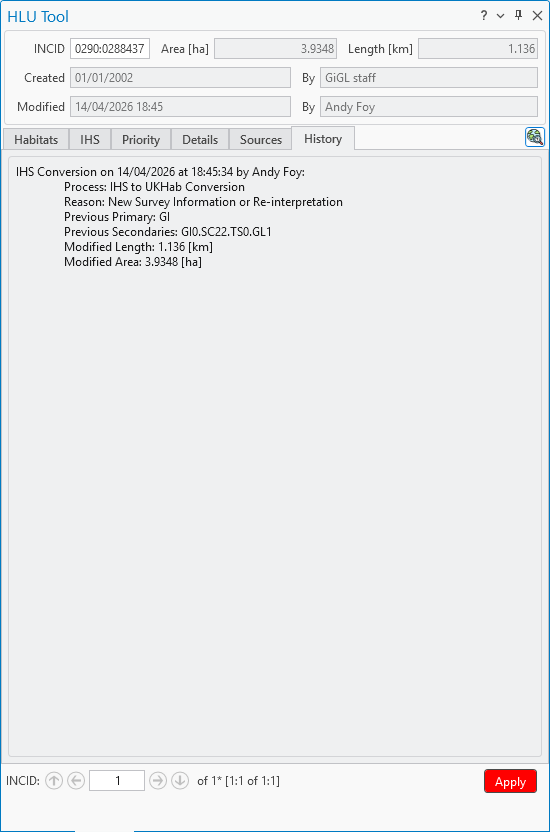

	Main Window - History Tab

The History tab displays a list of previous modifications made to the current INCID.

.. raw:: latex

	\newpage

Each entry details what modifications were made, when and by whom. Entries are shown in **descending** date and time order with the most recent changes at the top. The maximum number of entries to appear in the history tab can be configured in the Options (see :ref:`options_history` for more details).

.. _incid_status_section:

INCID Status Section
--------------------

The 'INCID Status' section contains navigation buttons (:guilabel:`First`, :guilabel:`Previous`, :guilabel:`Next`, :guilabel:`Last`) and a record number text box to enable users to move between INCID records **within the currently active filter**. It displays the current record position and the total number of records available for navigation (or the total number of INCID records in the database if there is no active filter). It also displays the number of features selected in the active HLU layer for the current INCID when the filter was applied, as well as the total number of features related to the current INCID in the database.

.. _figUIISS:

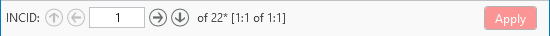

	Main Window - INCID Status Section

For example, figure :ref:`figUIISS` indicates that the interface is currently displaying record 4 of the 6 records in the active filter, and also shows that 2 features were selected in the active HLU layer out of a total of 3 features associated with the current INCID. Hence, only a **subset** of the features associated with the current INCID are selected in the layer.

.. note::
	All INCIDs in the active filter will always be retrieved in INCID order, so using the navigation buttons will always select the previous or next available INCID from those in the filter. A specific record can also be jumped to by typing its number directly into the record number text box and pressing :kbd:`Enter`.

This section also contains the :guilabel:`Apply` button which is used to apply any attribute changes to the current INCID. See :ref:`attribute_update` for more details.

.. note::
	The :guilabel:`Apply` button will only be displayed if:

		* The user is listed in the lut_user table.
		* The active HLU layer is editable in ArcGIS Pro.
		* A Reason and Process have both been selected in the HLU Tool ribbon.
		* The user has made one or more changes to the current INCID.
		* There are no fields in error.

.. raw:: latex

	\newpage

.. index::
	single: Windows; Warning and Error Messages

.. _error_messages:

Warning and Error Messages
--------------------------

Any fields that either have a warning associated with them or are in error will be highlighted

Warnings
	Warnings will be highlighted with an orange border and exclamation mark in a triangle (as seen in the figure :ref:`figUIWEM`). Hovering over a field with a warning will display a *tooltip* message indicating the nature of the warning.

Errors
	Errors will be highlighted with a red border and exclamation mark in a circle (as seen in the figure :ref:`figUIWEM`). The appropriate tab header for any invalid fields will also be highlighted to help users locate any errors in fields currently hidden on an inactive tab. Hovering over a field with an error will display a *tooltip* message indicating the nature of the error.

.. _figUIWEM:

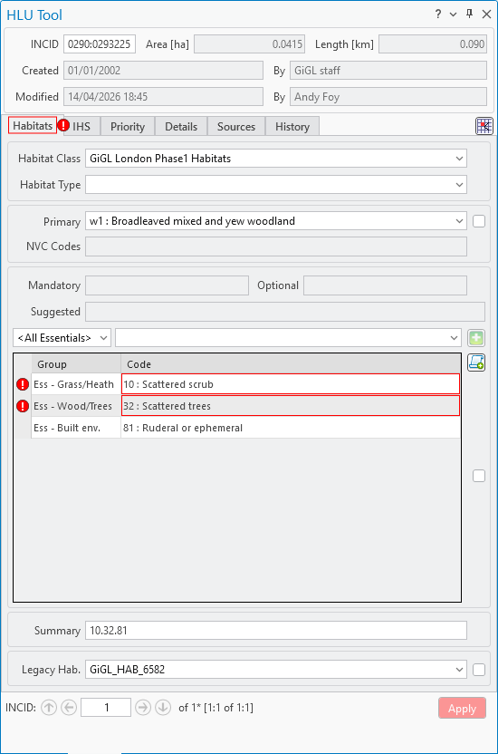

	Main Window - Warning and Error Messages

.. note::
	Whilst **any** fields are in error the :guilabel:`Apply` button will not be enabled.

.. raw:: latex

	\newpage

.. index::
	single: Windows; Priority Habitats Window

.. _priority_habitats_window:

Priority Habitats Window
========================

Allows users to edit any priority habitats as shown in the figure :ref:`figUIPHW`.

.. _figUIPHW:

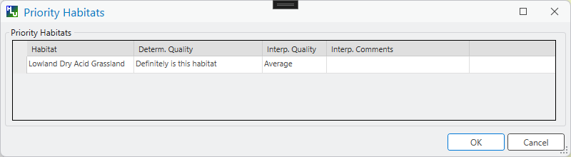

	Priority Habitats Window

Click |zoomtable| adjacent to the Priority Habitats table on the Priority tab to open the window.

.. index::
	single: Windows; Potential Priority Habitats Window

.. _potential_priority_habitats_window:

Potential Priority Habitats Window
==================================

Allows users to add, edit or delete any potential priority habitats as shown in the figure :ref:`figUIPPHW`.

.. _figUIPPHW:

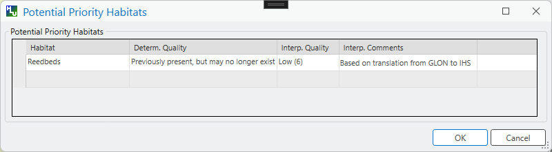

	Potential Priority Habitats Window

Click |zoomtable| adjacent to the Potential Priority Habitats table on the Priority tab to open the window.

.. raw:: latex

	\newpage

.. index::
	single: Windows; Bulk Updates Window
	single: Bulk Updates

.. _bulk_update_window:

Bulk Update Window
==================

The main window will transform into the bulk update window, as shown in the figure :ref:`figUIMWBU`, when the bulk update mode is started.

.. _figUIMWBU:

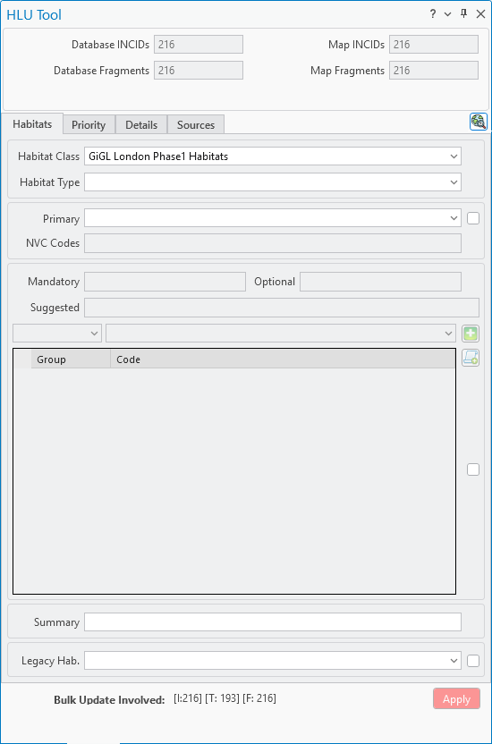

	Bulk Update Window

.. raw:: latex

	\newpage

The bulk update window appears the same as the main window except for the Bulk Update section and the INCID Status section. The IHS and History tabs will also be disabled.

.. note::
	Bulk update mode can only be started when:

	* The HLU layer is editable in ArcGIS Pro and a filter has been applied to the INCID records.
	* The user has been given bulk update permissions. For details on configuring users see 'Lookup Tables' in the HLU Tool Technical Guide at `readthedocs.org/projects/hlutool-arcpro-technicalguide <https://readthedocs.org/projects/hlutool-arcpro-technicalguide/>`_.

INCID Section
-------------

The 'INCID' section displays summary information for all of the INCIDs and GIS features currently filtered (as shown in the figure :ref:`figUIBUS`).

.. _figUIBUS:

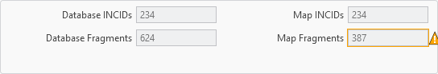

	Bulk Update Window - INCID Section

Database INCIDs
	Displays the number of INCIDs in the database for the active filter that the bulk update will be applied to.

Map INCIDs
	Displays the number of INCIDs for features selected in the active GIS layer that the bulk update will be applied to.

Database Fragments
	Displays the number of fragments in the database for the active filter.

Map Fragments
	Displays the number of fragments/features selected in the active GIS layer that the bulk update will be applied to.

.. note::
	Any discrepancies between the **Database** and **Map** counts will be highlighted with warning messages. This indicates that not all INCIDs or fragments in the database are held within the active GIS layer.

INCID Status Section
--------------------

The Bulk Update 'INCID Status' section shows the total number of INCIDs and fragments in the active filter.

.. _figUIBUSS:

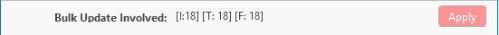

	Bulk Update Window - INCID Status Section

For example, figure :ref:`figUIBUS` indicates that the active filter currently contains 47 INCIDs and 58 fragments.

.. raw:: latex

	\newpage

.. index::
	single: Windows; Bulk Updates Confirmation Window
	single: Bulk Updates; Confirmation

.. _bulk_update_confirmation_window:

Bulk Update Confirmation Window
-------------------------------

Before a bulk update is applied a confirmation window will appear with a number of options relating to the update as shown in the figure :ref:`figUIBUC`.

.. _figUIBUC:

.. figure:: figures/UserInterfaceBulkUpdateConfirmation.png
	:align: center
	:scale: 85

	Bulk Update Confirmation Window

Delete Orphan Priority Habitats
	Whether existing priority habitats (those automatically associated with the current primary and secondary habitats) that are **orphaned** (i.e. not associated with the new primary and secondary habitats) should be deleted following a bulk update. If unchecked, any existing priority habitats are converted to potential priority habitats with the determination quality changed to 'Previous present, by may no longer exist'.

	.. note::
		This option will only be displayed if a new primary habitat has been entered for the bulk update.

Delete Potential Priority Habitats
	Whether existing potential priority habitats (those added manually by a user) should be deleted following a bulk update. If unchecked, any existing potential priority habitats will be retained.

	.. note::
		This option will only be displayed if a new primary habitat has been entered for the bulk update.

Delete Existing IHS Codes
	Whether any existing IHS habitat and multiplex (matrix, formation, management and complex) codes should be deleted following a bulk update.

Delete Existing Secondary Codes
	Whether any existing secondary habitat codes should be deleted following a bulk update.

	.. note::
		This option will only be displayed if a new primary habitat has been entered for the bulk update.

Delete Existing Source Rows
	[Read only]. Whether existing source rows will be deleted when one or more new sources are provided for a bulk update.

	.. note::
		This option cannot be controlled by the user - it is automatically determined based on whether one or more new sources are provided or not.

Create History Records
	Whether history records will be created when a bulk update is applied.

.. tip::
	The default values for all of the above fields (except for *Delete Existing Source Rows*) can be set in the options (see :ref:`options_bulk_update` for more details).

.. raw:: latex

	\newpage

.. index::
	single: Windows; Review OSMM Updates Window
	single: OSMM Updates; Review

.. _review_osmm_window:

Review OSMM Updates Window
==========================

The main window will transform into the OSMM review updates window, as shown in the figure :ref:`figUIMWOU`, when the review OSMM updates mode is started (see :ref:`review_osmm_updates` for more details).

.. _figUIMWOU:

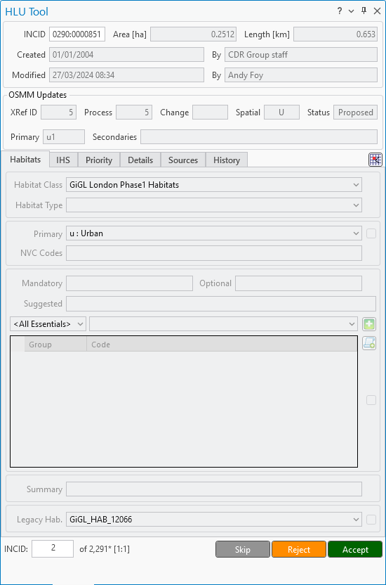

	Review OSMM Updates Window

.. raw:: latex

	\newpage

The window appears the same as the main window except for the OSMM Updates section and the INCID Status section.

.. note::
	OSMM review update mode can only be started when:

		* There are proposed OSMM update records in the database.
		* The user has been given bulk update permissions. For details on configuring users see 'Lookup Tables' in the HLU Tool Technical Guide at `readthedocs.org/projects/hlutool-arcpro-technicalguide <https://readthedocs.org/projects/hlutool-arcpro-technicalguide/>`_.

.. _review_osmm_section:

OSMM Updates Section
---------------------

The 'OSMM Updates' section displays summary details of any proposed or pending OSMM updates for each INCID in the database as shown in the figure :ref:`figUIROUS`.

.. _figUIROUS:

	Review OSMM Updates Window - OSMM Updates Section

XRef ID
	The unique identifier of the row in the ``lut_osmm_habitat_xref`` table. Each row represents a unique combination of OSMM attributes referenced by OSMM updates.

Process Flag
	Which step in the external OSMM Update process the proposed update was determined. Values represent the type of change in the primary habitat type from the original INCID feature to the new INCID feature, and the number of sources assigned to the original INCID feature, as follows:

		* 1 = Built to Built (only 1 source)
		* 2 = Built to Built (two or more sources)
		* 3 = Built to Natural (any number of sources)
		* 4 = Natural to Built (only 1 source)
		* 5 = Natural to Built (two or more sources)
		* 6 = Natural to Natural (only 1 source)
		* 7 = Natural to Natural (two or more sources)
		* 8 = Any to Unknown (any number of sources)
		* 9 = Unknown to any (except unknown) (any number of sources)

		.. note::
			The meanings of the Process, Change and Spatial flags may change in the future if different methods are used to determine proposed OSMM updates.

Change Flag
	Assists with prioritising proposed updates by summarising the type of habitat change. Values indicate whether the proposed habitat group (e.g. urban 'u') is the same as the original habitat group and whether it is a higher or lower level in the habitat hierarchy, as follows:

		* <blank> = Same group and habitat (e.g. g1a to g1a)
		* A = Same category but proposed habitat is higher level (e.g. g1a to g1a5)
		* B = Same category but proposed habitat is different and same or lower level (e.g. g1a to g2a, or g1a5 to g1a)
		* C = Proposed habitat is different and higher level (e.g. g1a to w1c5)
		* D = Proposed habitat is different and same level (e.g. g1a to w1c)
		* E = Proposed habitat is different and lower level (e.g. g1a to w1)

Spatial Flag
	Indicates whether part of the new feature has been changed compared to the original framework. An 'X' denotes when a feature (once the external OSMM Update process has been completed) overlaps two or more features in the original framework, and so a portion of the new feature may now be assigned to a different INCID than it was originally.

Status
	Indicates the current status of the proposed OSMM Update, as follows:

		* Proposed = the OSMM update has not be accepted or rejected by a user yet
		* Pending = the OSMM update has been accepted and is awaiting to be applied (see see :ref:`bulk_osmm_update_window` for more details)
		* Applied = the OSMM update has been accepted and applied
		* Ignored = the INCID was manually updated when an OSMM update was still proposed or pending and hence the OSMM update was ignored
		* Rejected = the OSMM update has been rejected

Primary
	The proposed primary habitat code based on the new OSMM attributes.

Secondary
	Concatenation of the proposed secondary habitat codes based on the new OSMM attributes.

Adopt
	Immediately applies the primary and secondary habitat codes from the pending OSMM update to the current INCID without needing to enter OSMM Bulk Update mode. The user still needs to save the changes to the current INCID before the update is applied. The OSMM status is only changed from 'Pending' to 'Applied' after a successful save.

	.. note::
		The :guilabel:`Adopt` button is only available when the active HLU layer is editable in ArcGIS Pro, the user has bulk update permissions, and the current INCID has a pending OSMM update.

.. raw:: latex

	\newpage

INCID Status Section
--------------------

The Review OSMM Updates 'INCID Status' section shows the total number of INCIDs in the active filter, and the number of TOIDs and fragments for the current INCID.

.. _figUIOUIS:

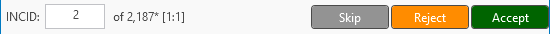

	Review OSMM Updates Window - INCID Status Section

For example, figure :ref:`figUIOUIS` indicates that the active filter currently contains 13 INCIDs and the current INCID consists of 1 TOID with 1 fragment.

The INCID Status section provides the following action buttons for processing each proposed OSMM update in turn:

:guilabel:`Skip`
	Skips the proposed update for the current INCID and moves to the next one. The skipped INCID retains its 'Proposed' status and can be reviewed again at a later time.

:guilabel:`Reject`
	Rejects the proposed update for the current INCID and moves to the next one. The update status is set to 'Rejected' and it will no longer be available for reviewing or applying.

:guilabel:`Accept`
	Accepts the proposed update for the current INCID and moves to the next one. The update status is set to 'Pending' and the update must subsequently be applied using OSMM Bulk Update mode (see :ref:`bulk_osmm_update_window` for more details).

Holding down the :guilabel:`Ctrl` key changes the :guilabel:`Reject` and :guilabel:`Accept` buttons to :guilabel:`Reject All` and :guilabel:`Accept All` thereby allowing the user to Reject or Accept **all** remaining INCIDs in the active filter in a single action.

.. _figUIOUIS2:

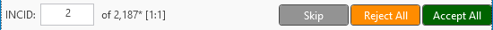

	Review OSMM Updates Window - INCID Status Section 2

For example, figure :ref:`figUIOUIS2` shows the 'INCID Status' section when the :guilabel:`Ctrl` key is pressed.

.. raw:: latex

	\newpage

.. index::
	single: Windows; OSMM Updates Filter Window
	single: OSMM Updates; Filter

.. _osmm_updates_filter:

OSMM Updates Filter
-------------------

When the review OSMM updates mode is first started, the OSMM Updates Filter window will appear as shown in the figure :ref:`figUIOUF`. This allows the user to filter which subset of proposed OSMM Updates to review.

.. _figUIOUF:

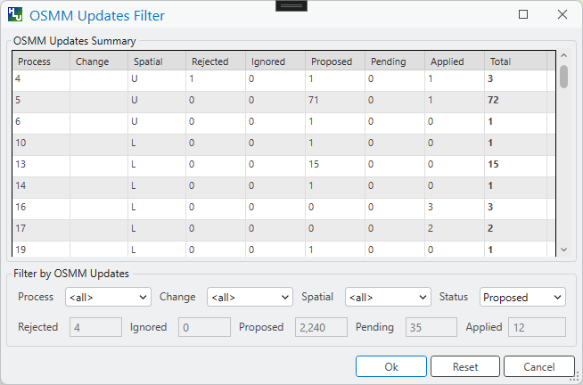

	Review OSMM Updates Filter Window

OSMM Updates Summary
	Displays a tabular summary of all the OSMM Updates in the database. Each row is a unique combination of the Process Flag, Change Flag, Spatial Flag and shows the number of records for each of the possible Status values (Rejected, Ignored, Proposed, Pending and Applied) and the total records for all statuses. Only combinations that exist in the database (rather than all possible combinations) will appear in the table.

	.. tip::
		Selecting one of the rows in the table will set the Process, Change and Spatial values in the Filter by OSMM Updates section to those of the selected row. However, the Status field will not be changed and must be selected manually.

Process
	Allows the user to select a specific value, to select only proposed updates with a given Process flag, or select <all> to select proposed updates with any Process flag.

Change
	Allows the user to select a specific value, to select only proposed updates with a given Change flag, or select <all> to select proposed updates with any Change flag.

Spatial
	Allows the user to select a specific value, to select only proposed updates with a given Spatial flag, or select <all> to select proposed updates with any Spatial flag.

Status
	Allows the user to select a specific value to select only proposed updates with a given pending status (Rejected, Ignored or Proposed).

	.. note::
		Typically only updates with a pending status of 'Proposed' would be selected, but the option to select updates with a pending status of 'Rejected' or 'Ignored' is available to enabled earlier actions to be reviewed or undone. However, it is **not** possible to select updates that have already been accepted or applied (i.e. have a status of 'Pending' or 'Applied').

OK
	Click :guilabel:`Ok` to apply the selected filter to the INCID records in the main interface and close the OSMM Updates Filter window.

Reset
	Click :guilabel:`Reset` to clear all of the Process, Change, Spatial and Status fields.

Cancel
	Click :guilabel:`Cancel` to close the OSMM Updates Filter window without applying a new filter.

.. note::
	The user can change the filter at any time when in Review OSMM Updates mode by clicking:

		* |filterbyattr| **Filter by Attributes** in the :ref:`filter_group` to open the OSMM Updates Filter window.
		* :guilabel:`Filter by Attributes - Advanced` to open the Advanced Query Builder window.

.. tip::
	Clicking on any of the column headings will sort the table by that column in ascending order. Clicking on the same column again will sort it in descending order.

.. index::
	single: Windows; OSMM Updates Advanced Filter Window
	single: OSMM Updates; Advanced Filter

.. _osmm_updates_advanced_filter:

OSMM Updates Filter - Advanced
------------------------------

As an alternative to the OSMM Updates Filter window that first appears when the review OSMM updates mode is first started, the advanced filter window can be used. This provides the user with greater control to filter which subset of proposed OSMM Updates to review.

To open the advanced filter window:

	* Close the standard OSMM Updates Filter window.
	* Click |filterbyattr| **Filter by Attributes** in the :ref:`filter_group` and then select the advanced option to open the Advanced Query Builder window.

.. seealso::
	See :ref:`advanced_query_builder_window` for more information.

.. raw:: latex

	\newpage

.. index::
	single: Windows; Bulk Apply OSMM Updates Window
	single: OSMM Updates; Bulk Apply

.. _bulk_osmm_update_window:

Bulk OSMM Update Window
=======================

The main window will transform into the bulk OSMM update window when the bulk OSMM update mode is started. The window appears the same as the main window except for the Bulk Update section and the INCID Status section as shown in the figure :ref:`figUIMWBOU`. The Habitats tab and History tab will also be disabled.

.. _figUIMWBOU:

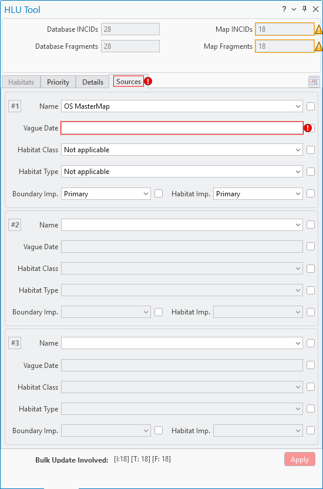

	Bulk OSMM Update Window

.. note::
	Bulk OSMM update mode can only be started when:

		* The HLU layer is editable in ArcGIS Pro.
		* The user has been given bulk update permissions. For details on configuring users see 'Lookup Tables' in the HLU Tool Technical Guide at `readthedocs.org/projects/hlutool-arcpro-technicalguide <https://readthedocs.org/projects/hlutool-arcpro-technicalguide/>`_.

.. raw:: latex

	\newpage

INCID Section
-------------

The 'INCID' section displays summary information for all of the INCIDs and GIS features currently filtered (see :ref:`bulk_update_window` for details).

INCID Status Section
--------------------

The Bulk Update 'INCID Status' section shows the total number of INCIDs, TOIDs and Fragments in the active filter (see :ref:`bulk_update_window` for details).

OSMM Updates Filter
-------------------

When the bulk OSMM updates mode is first started, the OSMM Updates Filter window will appear (see :ref:`osmm_updates_filter` for details). This allows the user to filter which subset of pending OSMM Updates the bulk update will apply to.

.. index::
	single: Windows; Bulk Apply OSMM Updates Confirmation Window

.. _bulk_osmm_update_confirmation_window:

Bulk OSMM Update Confirmation Window
------------------------------------

Before a bulk OSMM update is applied a confirmation window will appear with a number of options relating to the update as shown in the figure :ref:`figUIBOUC`.

.. _figUIBOUC:

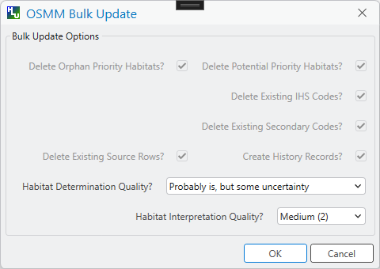

	Bulk OSMM Update Confirmation Window

Habitat Determination Quality
	The accuracy with which any priority habitats have been determined (e.g. 'Definitely is the priority habitat'). This will apply to all priority habitats created as a result of the OSMM updates.

Habitat Interpretation Quality
	An assessment of the quality and age of the habitat source, and the relationship between the habitat type and the priority habitat type (e.g. 'Low (5)'). This will apply to all priority habitats created as a result of the OSMM updates.

.. note::
	Some of the options cannot be controlled by the user - they are automatically set for bulk OSMM updates.

.. tip::
	The default values for these fields can be set in the options (see :ref:`options_bulk_update` for more details).

.. raw:: latex

	\newpage

.. _filter_Windows:

Filter Windows
==============

Allows users to filter the INCID records that appear in the user interface, and correspondingly which features are selected in the active GIS layer. The filter is performed by building a SQL query that will select one or more INCIDs based on a chosen set of criteria.

.. index::
	single: Windows; Advanced Query Builder Window
	single: Filter; Advanced Query Builder

.. _advanced_query_builder_window:

Advanced Query Builder Window
-----------------------------

Allows users to filter the database records using the advanced query builder shown in the figure :ref:`figAQB`.

Click |filterbyattr| **Filter by Attributes** in the :ref:`filter_group` of the HLU Tool ribbon to open the window.

.. _figAQB:

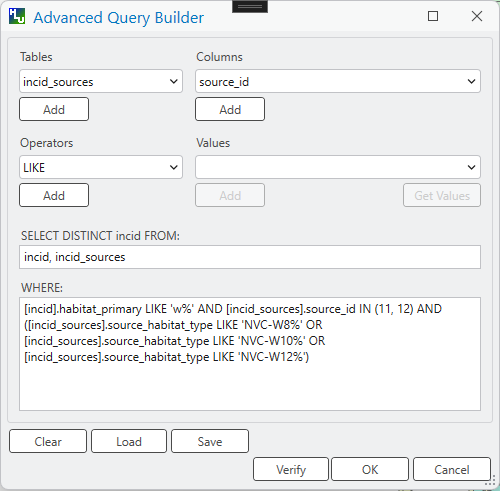

	Advanced Query Builder Window

Tables
	Identifies the table to be queried.

Columns
	Identifies the field in the selected table to be searched.

Operators
	Drop-down list of the available operators as shown in the figure :ref:`figASOL`.

Values
	The value to search for.  Values may automatically be loaded in the drop-down list, if the selected Table and Column refer to one of the lookup tables, or can be manually loaded using the :guilabel:`Get Values` button.

Add Buttons
	The :guilabel:`Add` buttons will paste the selected item from the relevant Tables, Columns, Operators or Values field into the **SELECT DISTINCT incid FROM:** text box or the **WHERE:** text box (as appropriate).

.. _figASOL:

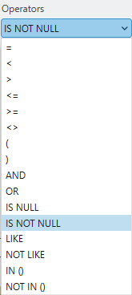

	Advanced Query Builder Window - List of Operators

SELECT DISTINCT incid FROM:
	A text box that should contain a comma-separated list of the tables that are referenced in the **WHERE** text box.

WHERE:
	A text box that should contain the SQL clause which will select the required INCID values from the HLU Tool database.

Clear
	Click the :guilabel:`Clear` button to remove any existing text from the **SELECT DISTINCT incid FROM:** and **WHERE:** text boxes.

Verify
	Click :guilabel:`Verify` to determine if the query is valid by checking the syntax of the text boxes and hence will execute successfully on the HLU Tool database. If the syntax is valid it will also determine if any records will be returned by the query.

Load
	Click :guilabel:`Load` to copy an existing query file into the text boxes. Users will be prompted for the source path and file name of an existing **.hsq** file. The default folder path can be set in the Options (see :ref:`options_filter` for more details).

Save
	Click :guilabel:`Save` to copy the text boxes to a query file. Users will be prompted for the destination path and file name of the **.hsq** file to save the query to. The default folder path can be set in the Options (see :ref:`options_filter` for more details).

OK
	Click :guilabel:`OK` to execute the query and close the query window. If the number of features to be selected exceeds the threshold configured in the GIS Options (see :ref:`options_gis`) a pop-up message will appear advising how many features will be selected.

Cancel
	Click :guilabel:`Cancel` to close the 'Advanced Query Builder' window without applying a new filter.

.. tip::
	Whilst the Tables and Where Clause can be entered as free-text by the user, it is recommended that users use the drop-down lists and :guilabel:`Add` buttons to reduce the likelihood of syntax errors.

.. index::
	single: Filter; Filter by Incid

.. _filter_by_incid_window:

Filter by Incid
---------------

Users can also filter the INCID records that appear in the user interface

Enter an INCID value directly into the **Find Incid** text box in the :ref:`filter_group` of the HLU Tool ribbon and press :kbd:`Enter` to filter to that record, or open the dedicated window as described below.

.. _figFBI:

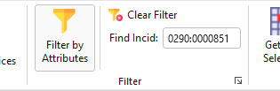

	Filter By Incid

.. raw:: latex

	\newpage

.. index::
	single: Exports
	single: Windows; Export Window

.. _export_window:

Export Window
=============

Allows users to combine both the GIS features and their associated attribute data from the HLU database and export the results to a new GIS layer using a pre-defined export format.

Click |export| **Export** in the :ref:`export_group` of the HLU Tool ribbon to open the Export window.

.. _figED:

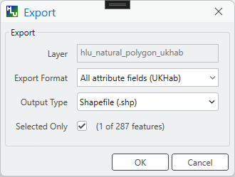

	Export Window

Layer
	Displays the active HLU layer.

Export Format
	Allows the user to choose one of the predefined export formats.

	.. seealso::
		For details on defining export formats see 'Configuring Exports' in the HLU Tool Technical Guide at `readthedocs.org/projects/hlutool-arcpro-technicalguide <https://readthedocs.org/projects/hlutool-arcpro-technicalguide/>`_.

Output Type
	Allows the user to select the required output type; a file geodatabase feature class or a shaepfile.

Selected Only
	Allows the user to choose if only the selected features in the active GIS layer will be exported or if all features from the active GIS layer associated with the INCIDs in the active filter will be exported.

	.. note::
		If the database records have been filtered the 'Selected Only' checkbox is automatically ticked and the number of selected GIS features is shown (as seen in :ref:`figED`). Only the records related to the selected INCIDs and associated GIS features from the active GIS layer will be exported. Untick this checkbox to export all features from the active GIS layer associated with the INCIDs in the active filter. For details on how to filter records see :ref:`filter_by_attributes`.

.. raw:: latex

	\newpage

.. index::
	single: Bulk Unload
	single: Windows; Bulk Unload Window

.. _bulk_unload_window:

Bulk Unload Window
==================

Allows users to remove selected registered features from the active HLU layer and cleans up their associated database records.

Click the |bulkload| :guilabel:`Bulk Load` button of the HLU Tool ribbon and select **Bulk Unload** from the drop-down menu to open the Bulk Unload - Select Layers window.

.. _figBUSL:

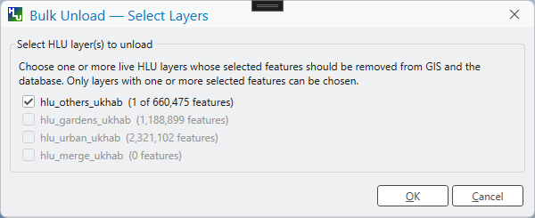

	Bulk Unload - Select Layers Window

Select HLU Layer(s) to unload
	Allows the user to select one or more HLU layers whose selected features are to be removed from the layers and the database.

	.. note::
		Only layers with one or more selected features can be chosen.

OK
	Click :guilabel:`OK` to execute the bulk unload.

Cancel
	Click :guilabel:`Cancel` to cancel the bulk unload.

.. raw:: latex

	\newpage

.. index::
	single: Bulk Load
	single: Windows; Bulk Load Window

.. _bulk_load_window:

Bulk Load Window
================

Allows users to register new features against new INCIDs using OSMM (Ordnance Survey MasterMap) attributes matched against the OSMM cross-reference table.

Click the |bulkload| :guilabel:`Bulk Load` button of the HLU Tool ribbon and select **Bulk Load** from the drop-down menu to open the Bulk Load window.

.. _figBL:

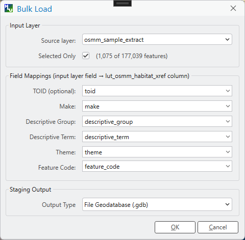

	Bulk Load Window

Source layer
	Allows the user to select the OSMM source layer.

Selected Only
	Allows the user to choose if only the selected features in the source layer will be loaded or if all features from the source layer will be loaded.

	.. note::
		If one or more features in the source layer have been selected the 'Selected Only' checkbox is automatically ticked and the number of selected GIS features is shown (as seen in :ref:`figED`). Only the selected features from the source layer will be loaded. Untick this checkbox to load all features from the source layer.

TOID (optional)
	Allows the user to optionally select the topographic identifier field in the source layer (if present). Select **<None>** to ignore this field mapping.

	.. note::
		If a TOID field is not mapped then all features loaded into the staging layer will have NULL TOID values.

Make
	Allows the user to select the OSMM Make field in the source layer.

Descriptive Group
	Allows the user to select the OSMM Descriptive Group field in the source layer.

Descriptive Term
	Allows the user to select the OSMM Descriptive Term field in the source layer.

Theme
	Allows the user to select the OSMM Theme field in the source layer.

Feature Code
	Allows the user to select the OSMM Feature Code field in the source layer.

Staging Output Type
	Allows the user to select the required staging layer output type; a file geodatabase feature class or a shapefile.

OK
	Click :guilabel:`OK` to proceed with the bulk load.

Cancel
	Click :guilabel:`Cancel` to cancel the bulk load.

.. raw:: latex

	\newpage

.. index::
	single: Bulk Load
	single: Windows; OSMM Attribute Preview Window

.. _osmm_attribute_preview_window:

OSMM Attribute Preview Window
=============================

The OSMM Attribute Preview window appears during the bulk load operation after the staging layer path has been selected. It displays a summary of how the OSMM attributes from the source layer will be matched against the OSMM cross-reference table.

.. _figBLOAP:

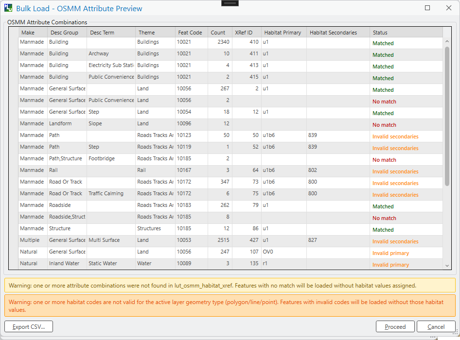

	OSMM Attribute Preview Window

OSMM Attribute Matches
	Displays a table showing the results of matching the source OSMM attributes against the ``lut_osmm_habitat_xref`` table. Each row represents a unique combination of OSMM attributes found in the source layer and shows:

Make
	The OSMM Make attribute value from the source features.

Descriptive Group
	The OSMM Descriptive Group attribute value from the source features.

Descriptive Term
	The OSMM Descriptive Term attribute value from the source features.

Theme
	The OSMM Theme attribute value from the source features.

Feature Code
	The OSMM Feature Code attribute value from the source features.

Count
	The number of source features with the same combination of OSMM attributes.

XRef ID
	The unique reference ID of the matching row in the cross-reference table.

	.. note::
		Rows where the XRef ID column is blank indicate that no match was found in the OSMM cross-reference table ``lut_osmm_habitat_xref``. Features with these attribute combinations will be loaded to the staging layer but their habitat codes will remain null and must be assigned manually.

Primary
	The primary habitat code that will be assigned based on the matched OSMM attributes. Will be blank if no match was found in the cross-reference table.

Secondary
	The secondary habitat code(s) that will be assigned based on the matched OSMM attributes. Will be blank if no match was found or if no secondary codes apply.

Features
	The number of features in the source layer with this combination of OSMM attributes.

Export CSV
	Click :guilabel:`Export CSV` to save the attribute matching results to a CSV file. This is useful for:

	* Reviewing the matches offline
	* Identifying OSMM attribute combinations that did not match any habitat codes
	* Updating the ``lut_osmm_habitat_xref`` table with new or corrected mappings

	.. note::
		The CSV export will include all rows from the preview table, including those without matches.

OK
	Click :guilabel:`OK` to proceed with the bulk load operation using the displayed attribute matches.

Cancel
	Click :guilabel:`Cancel` to abort the bulk load operation.

.. raw:: latex

	\newpage

.. index::
	single: Reassign Features
	single: Windows; Reassign Features Window

.. _reassign_features_window:

Reassign Features Window
========================

Allows users to move features from the active HLU layer to one or more target HLU layers based on configurable rules.

Click the |reassign| :guilabel:`Reassign Features` button in the HLU Tool ribbon to open the Reassign Features window.

.. _figRF:

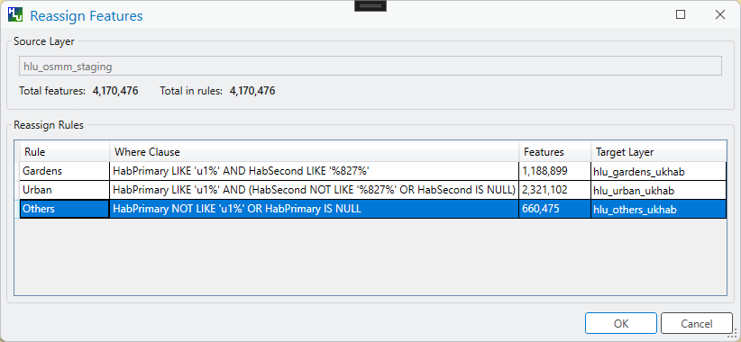

	Reassign Features Window

Source Layer
	Displays the name of the currently active HLU layer.

Total features
	Displays the total number of features in the source layer.

Total in rules
	Displays the total number of features represented by all rules. When any rule is still counting features this will show "Counting…".

	.. note::
		If the total in rules does not match the total features in the source layer, a warning message will be displayed indicating the difference. This means some features will not be moved by any rule.

Reassign Rules
	Displays a table of all configured reassign rules with the following columns:

Rule
	The name of the rule.

Where Clause
	The SQL WHERE clause that selects features for this rule.

Features
	The number of features in the source layer that match this rule's WHERE clause. Shows "Counting…" while the count is being calculated.

Target Layer
	A drop-down list allowing the user to select which HLU layer the matched features should be moved to. Select **<Skip>** to not apply this rule in the current operation.

.. note::
	Rules are applied sequentially from top to bottom. Once a feature is moved by a rule, it is no longer available for subsequent rules.

OK
	Click :guilabel:`OK` to start the reassign operation. All rules not set to <Skip> will be applied in order.

Cancel
	Click :guilabel:`Cancel` to cancel the reassign operation and close the window.
