*******
Options
*******

.. index::
	single: Windows; Options Window
	single: Options

.. _options_window:

The Options window allows users to configure the HLU Tool. The window is organised into two categories in a navigation sidebar:

* **Application** — settings shared across all users (database, dates, validation, updates, bulk update defaults).
* **User** — settings specific to the current user (interface, GIS, updates, SQL, history, export).

.. |options| image:: ../icons/Options.png
	:height: 16px
	:width: 16px

Click |options| **Options** in the :ref:`help_group` of the HLU Tool ribbon to open the Options window.

.. index::
	single: Options; Application Options

Application Options
===================

.. index::
	single: Options; Database

.. _options_database:

Database Options
----------------

The following options relate to how the HLU Tool interacts with the underlying database.

.. _figOWD:

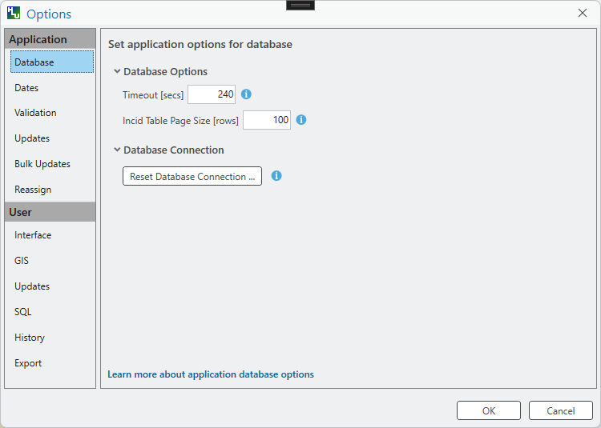

	Options Window - Database

Timeout
	Sets the amount of time the tool will wait (in seconds) for the database to respond. The default value is 15. This value should be increased if an error occurs such as 'The connection to the database timed out' or if the network and/or database connection is known to be slow.

Incid Table Page Size
	Sets how many rows are retrieved from the database and stored in memory. The default value is 100. Increasing this value can improve performance when browsing records, however this will increase the amount of RAM required by the application and significant increases in the page size value could cause the tool to stop responding.

Reset Database Connection
	Clears the saved database connection settings. You will be prompted to choose a new connection the next time the HLU Tool is loaded. Use this option if the database server has moved, the database name has changed, or the connection is no longer valid.

	.. note::
		When the HLU Tool connects to the database it validates the database version against the minimum required version. If the database version is below the minimum, a warning will be displayed and the tool will not load until the database has been upgraded.

.. index::
	single: Options; Dates

.. _options_dates:

Dates Options
-------------

The following options relate to the formatting of vague dates used in the sources section of the dockpane. These are application-wide settings found under **Application > Dates** in the Options navigation.

.. _figOWDa:

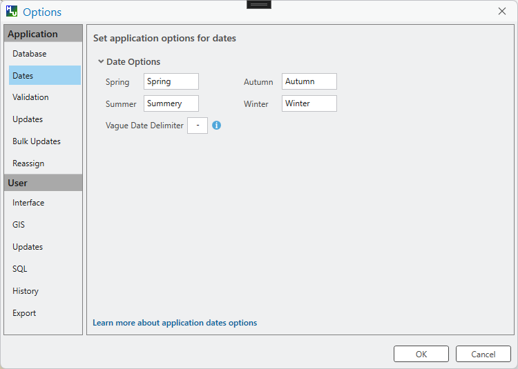

	Options Window - Dates

Seasons
	These fields allow users to define how seasonal dates, such as 'Spring 2009' or 'Winter 2010', are entered so that they can be converted to dates in the HLU database.

Vague Date Delimiter
	This field allow users to define how date ranges, such as 'Spring 2010-Autumn 2010' or '1989-2010', are entered so that they can be converted to dates in the HLU database.

	.. note::
		The default value for the 'Vague Date Delimiter' is a hyphen ( - ). This can be altered to any character, however, it must not be the same delimiter used by the computer to enter precise dates, such as 01/04/2010. The default delimiter used by Windows for English-format dates is a forward slash ( / ).

.. index::
	single: Options; Validation

.. _options_validation:

Validation Options
------------------

The following options relate to data validation rules applied when attribute updates are made. These are application-wide settings found under **Application > Validation** in the Options navigation.

.. _figOWVal:

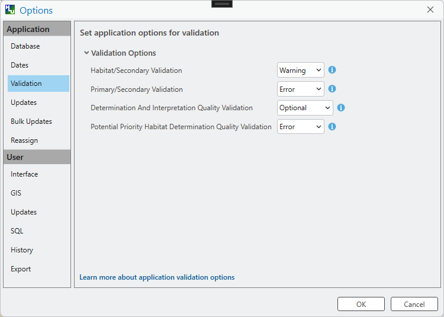

	Options Window - Validation

Habitat/Secondary Validation
	Allows users to select whether mandatory secondary codes for the selected source habitat type are validated, i.e. have been added to the secondary table, and if the missing codes are considered as errors or just warnings. The available actions are:

		* Ignore - Missing mandatory secondary codes for the selected source habitat type are **ignored**.
		* Warning - Missing mandatory secondary codes for the selected source habitat type are flagged with a **warning**.
		* Error - Missing mandatory secondary codes for the selected source habitat type are flagged with an **error**.

Primary/Secondary Validation
	Allows users to select whether secondary codes for the selected primary habitat are validated, i.e. have been added to the secondary table. The available actions are:

		* Ignore - Missing secondary codes for the selected primary habitat are **ignored**.
		* Error - Missing secondary codes for the selected primary habitat are flagged with an **error**.

Determination And Interpretation Quality Validation
	Allows users to select whether entering determination and interpretation values to reflect the quality of the selected primary and secondary habitats. The available actions are:

		* Optional - Determination and interpretation quality are **optional** for every INCID.
		* Mandatory - Determination and interpretation quality are **mandatory** for every INCID.

Potential Priority Habitat Determination Quality Validation
	Allows users to select whether the determination quality value for potential priority habitats is validated. The available actions are:

		* Ignore - The determination quality value for potential priority habitats is **ignored** (i.e. is not validated).
		* Error - Invalid determination quality values for potential priority habitats are flagged with an **error**.

	.. note::
		Ignoring the validation for potential priority habitats enables the user to select determination quality values that indicate that the habitat **is** or **probably is** in the associated feature(s). Otherwise determination quality values can **ONLY** be 'Not present but close to definition' or 'Previously present, but may no longer exist'.

.. index::
	single: Options; Updates

.. _options_updates:

Update Options
--------------

The following options relate to what happens when attribute updates are applied. These are application-wide settings found under **Application > Updates** in the Options navigation.

.. _figOWU:

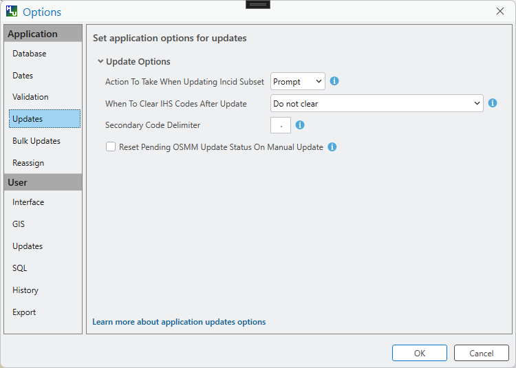

	Options Window - Updates

Action to Take When Updating Subset
	Allows users to select what action to take if they attempt to apply attribute changes to only a subset of features for an INCID (see :ref:`attribute_update` for more details). The available actions are:

		* Prompt - Always **prompt** the user when attempting to update a subset of INCID features (see :ref:`attribute_update` for an example of the prompt dialog).
		* Split - Always perform a **logical split** before applying the attribute updates.
		* All - Always apply the attribute update to **all** features belonging to the INCID regardless of which features of the INCID are currently selected.

When To Clear IHS Codes After Update
	Allows users to select when existing IHS Codes should be cleared when attribute updates are applied. The available options are:

		* Do not clear - **Do not clear** any existing IHS habitat and multiplex codes following an attribute update.
		* Clear on change in primary code only - Clear any existing IHS habitat and multiplex codes **only** following a change to the primary habitat code.
		* Clear on change in primary or secondary codes only - Clear any existing IHS habitat and multiplex codes following a change to **either** the primary or secondary habitat codes.
		* Clear on any change - Clear any existing IHS habitat and multiplex codes following **any** change in an attribute update.

Reset Pending OSMM Update Status On Manual Update
	Allows the user to choose if the status of any pending OSMM Updates for the current INCID should be reset to 'Ignored' when an **attribute update** is applied.

Secondary Code Delimiter
	Allows users to choose the delimiter characters (e.g. '.' or ', ') that are used to separate any secondary habitat codes in the Summary field. Up to 2 non-alphanumeric characters can be entered.

	.. warning::
		This option will also affect the concatenated secondary codes summary saved in the active HLU layer so changes should be applied with caution.

.. index::
	single: Options; Bulk Update

.. _options_bulk_update:

Bulk Update Options
-------------------

The following options relate to the **default** values to use when applying bulk updates and OSMM bulk updates (see :ref:`bulk_update` for details). All options can be amended during the bulk update process. These are application-wide settings found under **Application > Bulk Updates** in the Options navigation.

.. _figOWBU:

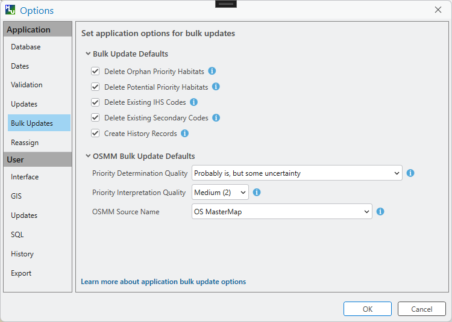

	Options Window - Bulk Update

Delete Orphan Priority Habitats
	The default option for whether existing priority habitats (those automatically associated with the current primary and secondary habitats) that are **orphaned** (i.e. not associated with the new primary and secondary habitats) should be deleted following a change to the primary habitat during a bulk update. If unchecked, any existing priority habitats are converted to potential priority habitats with the determination quality changed to 'Previous present, by may no longer exist'.

Delete Potential Priority Habitats
	The default option for whether existing potential priority habitats (those added manually by a user) should be deleted following during a bulk update. If unchecked, any existing potential priority habitats will be retained.

Delete Existing IHS Codes
	The default option for whether existing IHS habitat and multiplex (matrix, formation, management and complex) codes should be deleted following a change to the habitat during a bulk update. If checked, any existing multiplex codes will be deleted, otherwise they will be retained.

Delete Existing Secondary Codes
	The default option for whether existing secondary codes should be deleted following a change to the primary habitat during a bulk update. If checked, any existing secondary codes will be deleted, otherwise they will be retained and may not be compatible with the new primary habitat (see :ref:`options_updates` for more details).

Create History Records
	The default option for whether history records will be created when a bulk update is applied.

Priority Determination Quality
	The default option for which determination quality to apply to any new priority habitats (those automatically associated with the new primary habitat) following a change to the primary habitat during an OSMM bulk update.

Priority Interpretation Quality
	The default option for which interpretation quality to apply to any new priority habitats (those automatically associated with the new primary habitat) following a change to the primary habitat during an OSMM bulk update.

OSMM Source Name
	The default option for which Ordnance Survey MasterMap source name to use when automatically adding a new source record during an OSMM bulk update.

.. raw:: latex

	\newpage

.. index::
	single: Options; User Options

User Options
============

.. index::
	single: Options; Interface

.. _options_interface:

Interface Options
-----------------

The following options relate to how the HLU Tool dockpane appears. These are user-specific settings found under **User > Interface** in the Options navigation.

.. _figOWI:

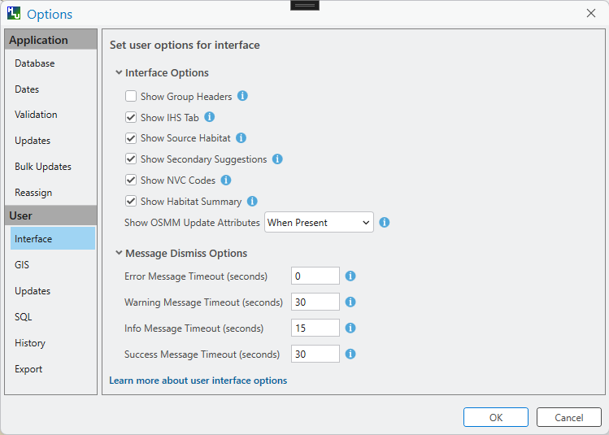

	Options Window - Interface

Show Group Headers
	Allows the user to choose if section headers will be shown or hidden in the dockpane (to reduce the height of the interface).

Show IHS Tab
	Allows the user to choose if the IHS tab will be shown or hidden in the dockpane.

Show Source Habitat
	Allows the user to choose if the Source Habitat group, containing the Habitat Class and Habitat Type lists, will be shown or hidden in the dockpane. The group can be hidden if the source habitat data is in UKHab and primary and secondary habitats are being entered directly without any need to assist the user with translating from other habitat classifications.

Show Secondary Suggestions
	Allows the user to choose if any suggested secondary habitats related to the source habitat type and selected primary habitat are shown.

Show NVC Codes
	Allows the user to choose if a list of any potential NVC Codes related to the selected primary habitat will be shown.

Show Habitat Summary
	Allows the user to choose if the summary of the primary and secondary codes will be shown or hidden in the dockpane (to reduce the height of the interface).

Show OSMM Update Attributes
	Allows the user to choose when Ordnance Survey MasterMap (OSMM) updates should be shown (see :Ref:`osmm_update_section` for more details). The available options are:

		* Never - **Never** show the OSMM Updates section.
		* When Outstanding - Only show the OSMM Updates section when the update is **outstanding** (the status is 'Proposed' or 'Pending').
		* Always - **Always** show the OSMM Updates section.

.. index::
	single: Options; GIS

.. _options_gis:

GIS Options
-----------

The following options relate to how the HLU Tool interacts with ArcGIS Pro. These are user-specific settings found under **User > GIS** in the Options navigation.

.. _figOWGIS:

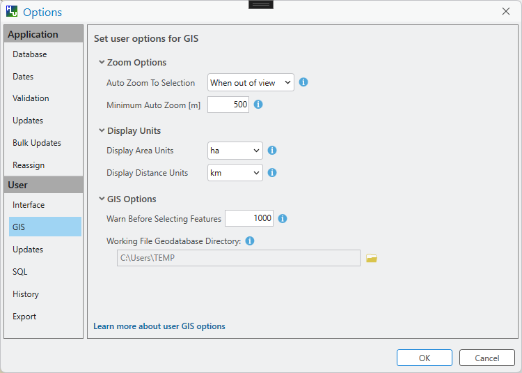

	Options Window - GIS

Auto Zoom To Selection
	Sets when the map view should automatically zoom to the features associated with the current INCID whenever the INCID selection changes. Choices are 'Off', 'When out of view' and 'Always'.

Minimum Auto Zoom
	The minimum map scale (e.g. 1000) at which the auto-zoom function activates. Lower values zoom in closer; higher values zoom out further.

Display Area Units
	Sets the units used to display the area of the current INCID in the dockpane and in history records (e.g. hectares or square metres).

Display Distance Units
	Sets the units used to display the perimeter length of the current INCID in the dockpane and in history records (e.g. metres or kilometres).

Warn Before Selecting Features
	Sets the maximum number of features that may be selected in ArcGIS Pro before a warning is shown, as large selections may take some time. Set to zero to disable warnings.

Working File Geodatabase Directory
	Sets the folder path for a working File Geodatabase used when performing large or complex GIS queries.

	.. note::
		The path is validated when the Options window is closed. If the specified folder does not exist or is not accessible, an error will be shown and the setting will not be saved until a valid path is provided.

.. index::
	single: Options; User Updates

.. _options_user_updates:

Update Options
--------------

The following options relate to default values and preferences for update operations. These are user-specific settings found under **User > Updates** in the Options navigation.

.. _figOWUUser:

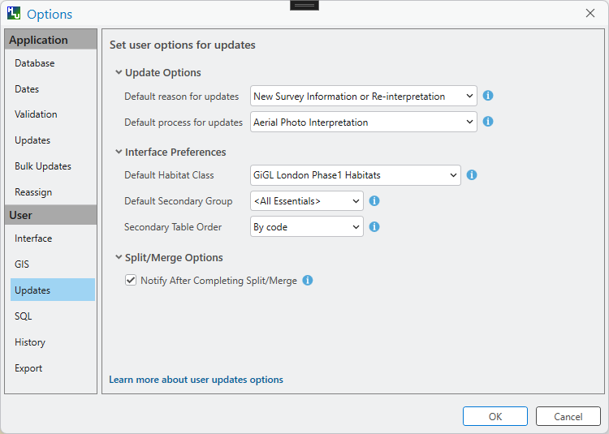

	Options Window - User Updates

Default Reason
	Sets the default reason that is pre-selected in the :ref:`updates_group` of the ribbon each time the HLU Tool is opened.

Default Process
	Sets the default process that is pre-selected in the :ref:`updates_group` of the ribbon each time the HLU Tool is opened.

Default Habitat Class
	Allows the user to choose which Habitat Class in the Habitats tab (see :ref:`habitats_tab` for more details) is automatically selected each time the HLU Tool is opened.

Default Secondary Group
	Allows the user to choose which Secondary Group in the Habitats tab (see :ref:`habitats_tab` for more details) is automatically selected each time the HLU Tool is opened.

Secondary Table Order
	Allows the user to choose the order that any secondary habitats appear in the secondary table.

Notify After Completing Split/Merge
	Allows users to specify if a pop-up message should be displayed following the completion of any of the split or merge operations.

.. index::
	single: Options; SQL
	single: Options; Filter

.. _options_filter:

SQL Options
-----------

The following options relate to the advanced query builder used to filter INCID records. These are user-specific settings found under **User > SQL** in the Options navigation.

.. _figOWF:

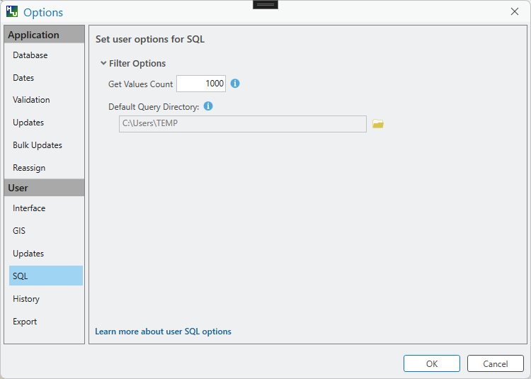

	Options Window - SQL

Get Values Count
	Allows the user to select the maximum number of unique field values that will be retrieved each time the :guilabel:`Get Values` button is pressed when using the 'Advanced Query Builder' (see :ref:`advanced_query_builder_window` for details). The maximum number of rows that can be retrieved at any time cannot exceed 100,000. This number should be reduced if performance issues are experienced when the :guilabel:`Get Values` button is pressed or when the drop-down list is used on the 'Advanced Query Builder'.

Default Query Directory
	Enables users to set a default folder path that will be used when saving or loading queries with the 'Advanced Query Builder' (see :ref:`advanced_query_builder_window` for details). A different path to the default can also be selected during the save and load process.

.. note::
	The threshold for warning before selecting features in ArcGIS Pro is now configured in the **GIS Options** (see :ref:`options_gis`).

.. index::
	single: Options; History

.. _options_history:

History Options
---------------

The following options relate to how history records are displayed in the HLU Tool dockpane. These are user-specific settings found under **User > History** in the Options navigation.

.. _figOWH:

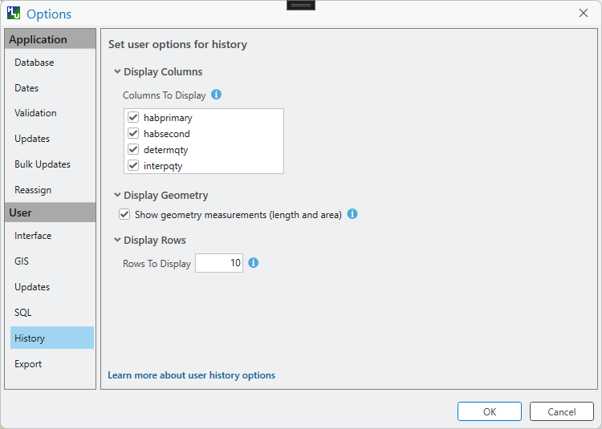

	Options Window - History

History Display Columns
	Allows users to select which additional columns from the GIS layer are displayed in the History tab for each update. If the checkbox for a column is ticked, the column will be displayed.

Display History Rows
	Sets the number of entries displayed in the 'History' tab of the main window. For more details on the 'History' tab see :ref:`history_tab`.

.. index::
	single: Options; Export

.. _options_export:

Export Options (User)
---------------------

The following options relate to exporting data. These are user-specific settings found under **User > Export** in the Options navigation.

.. _figOWExport:

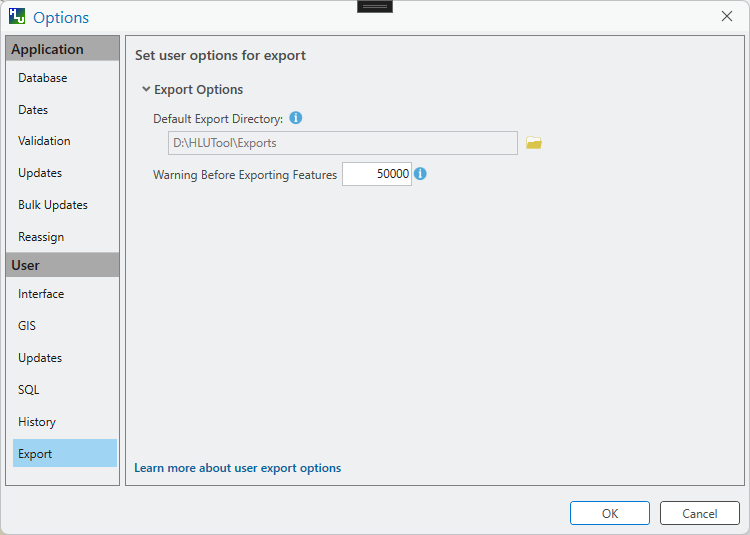

	Options Window - Export

Default Export Directory
	Sets the default destination folder path used when exporting data (see :ref:`export_window` for more details). A different path can still be selected during the export process.

Warning Before Exporting Features
	Sets the number of features above which a warning is shown before starting an export, as the operation may take some time. Set to zero to disable the warning.
