.. |insertfeature| image:: ../icons/InsertFeature.png
	:height: 16px
	:width: 16px

*******
Toolbar
*******

The HLU Tool is an ArcGIS Pro add-in. All of its functions are accessed through a dedicated **HLU Tool** tab that appears on the ArcGIS Pro ribbon when the add-in is loaded. The tab is organised into functional groups, each described in the sections below.

.. _figUITab:

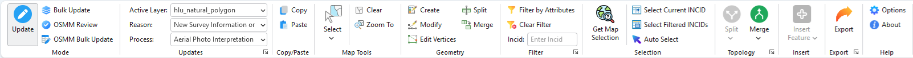

	HLU Tool Ribbon - Tab

.. note::
	The **HLU Tool** tab is only visible when a map view is open and the add-in has been activated. To open the HLU Tool dockpane click the :guilabel:`HLU Tool` button on the **HLU Tool** group of the ArcGIS Pro **Data** tab.

.. raw:: latex

	\newpage

.. index::
	single: Toolbar; Mode Group
	see: Mode Group; Toolbar

.. _mode_group:

Mode Group
==========

.. _figUIGMode:

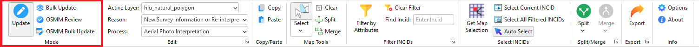

	HLU Tool Ribbon - Mode Group

The **Mode** group controls which editing mode is currently active. Only one mode can be active at a time. The group contains the following buttons:

|update| Update
---------------

Activates **Update** mode — the normal editing mode for viewing and updating the attributes of individual INCIDs one at a time.

.. note::
	This is the default mode when the tool is first opened. To enable editing, the user details must be configured in the database (see 'Lookup Tables' in the HLU Tool Technical Guide at `readthedocs.org/projects/hlutool-arcpro-technicalguide <https://readthedocs.org/projects/hlutool-arcpro-technicalguide/>`_ for details) and the HLU layer must be editable in ArcGIS Pro.

|bulkupdate| Bulk Update
------------------------

Activates **Bulk Update** mode, which allows attribute updates to be applied simultaneously to all INCIDs in the active filter.

.. seealso::
	See :ref:`bulk_update_window` for more information.

|osmmreview| OSMM Review
------------------------

Activates **OSMM Review** mode, which allows proposed OS MasterMap (OSMM) updates to be reviewed and accepted or rejected one INCID at a time.

.. seealso::
	See :ref:`review_osmm_window` for more information.

|osmmBulkupdate| OSMM Bulk Update
----------------------------------

Activates **OSMM Bulk Update** mode, which allows all accepted (pending) OSMM updates to be applied in bulk in a single operation.

.. seealso::
	See :ref:`bulk_osmm_update_window` for more information.

.. raw:: latex

	\newpage

.. index::
	single: Toolbar; Updates Group
	single: Active Layer
	single: Switch GIS Layer
	single: Reason
	single: Process
	see: Updates Group; Toolbar

.. _updates_group:

Updates Group
=============

.. _figUIGUpdates:

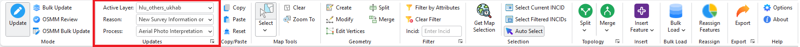

	HLU Tool Ribbon - Updates Group

The **Updates** group provides controls for configuring the active layer and recording the reason and process for any attribute changes.

.. note::
	The reason and process fields are required values for all update actions (attribute updates, splits, merges and bulk updates) and are recorded in the History table to indicate **why** the record was updated. The selected values are **sticky** — they are retained for all subsequent actions in the current session until changed.

The **Updates** group contains the following controls:

Active Layer
------------

A drop-down list for selecting the active HLU feature layer in the current ArcGIS Pro map. Allows users to select which HLU feature layer in the current ArcGIS Pro map is being worked on, as shown in the figure :ref:`figUIGUpdates`.

.. note::
	Only valid HLU layers present in the current ArcGIS Pro map (i.e. layers with the correct attribute names and formats) will appear in the list.

.. tip::
	The currently active layer is automatically selected in the drop-down list when the HLU Tool is opened or when the map contents change.

.. _reason_section:

Reason
------

A drop-down list for selecting the reason for the updates about to be made. A reason must be selected before any updates can be saved.

.. _process_section:

Process
-------

A drop-down list for selecting the process associated with the updates about to be made. A process must be selected before any updates can be saved.

**Reason** and **Process** options must both be selected before any update, split, merge or bulk update operation can be applied. The selected values are recorded in the history table to indicate why and how the INCID record was changed.

.. note::
	The selected Reason and Process values are **sticky** — they are retained across all update operations in the current session until changed. Default values for both can be pre-configured in the user options (see :ref:`options_user_updates` for more details).

.. raw:: latex

	\newpage

.. index::
	single: Toolbar; Copy/Paste Group
	see: Copy/Paste Group; Toolbar

.. _copy_paste_group:

Copy/Paste Group
================

.. _figUIGCopyPaste:

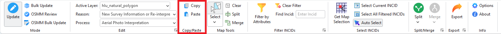

	HLU Tool Ribbon - Copy/Paste Group

The **Copy/Paste** group contains the following buttons:

|copy| Copy
-----------

Copies the selected attributes from the current INCID record so they can be pasted into another record.

.. _figCC:

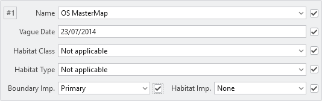

	HLU Tool Dockpane - Copy Checkboxes

Tick the checkboxes next to the fields to be copied, as shown in the figure :ref:`figCC`, then click :guilabel:`Copy`.

|paste| Paste
-------------

Pastes the attributes copied by the **Copy** button into the same fields in the currently displayed INCID record.

.. note::
	It is not possible to copy data from one field and paste it into a different field.

.. raw:: latex

	\newpage

.. index::
	single: Toolbar; Map Tools Group
	see: Map Tools Group; Toolbar

.. _map_tools_group:

Map Tools Group
===============

.. _figUIGMapTools:

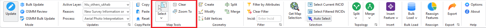

	HLU Tool Ribbon - Map Tools Group

The **Map Tools** group exposes standard ArcGIS Pro tools used in conjunction with the HLU Tool. It contains the following controls:

Select Tool Palette
-------------------

The standard ArcGIS Pro selection tool palette, providing access to the rectangle, lasso, circle and other spatial selection methods for selecting features in the active HLU layer.

Clear Selection
---------------

Clears the current feature selection in the active HLU layer (standard ArcGIS Pro :guilabel:`Clear` button).

Zoom To
-------

Zooms to the selected features of all layers in the active map (standard ArcGIS Pro :guilabel:`Zoom To` button).

.. raw:: latex

	\newpage

.. index::
	single: Toolbar; Geometry Group
	see: Geometry Group; Toolbar

.. _geometry_group:

Geometry Group
==============

.. _figUIGGeometry:

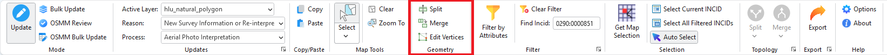

	HLU Tool Ribbon - Geometry Group

The **Geometry** group exposes standard ArcGIS Pro editing tools used in conjunction with the HLU Tool. It contains the following controls:

Create Features
---------------

Opens the ArcGIS Pro **Create Features** pane, allowing new features to be drawn in the active HLU layer using the standard ArcGIS Pro editing tools. New features drawn this way will not initially have an INCID or fragment identifier assigned — use the :ref:`feature_insert_group` to register them against the database.

Modify Features
---------------

Opens the ArcGIS Pro **Modify Features** pane, providing access to editing tools for modifying existing feature geometry.

Edit Vertices
-------------

Edits the vertices of the currently selected feature using the standard ArcGIS Pro :guilabel:`Edit Vertices` command.

Split
-----

Splits the currently selected feature at a digitised line using the standard ArcGIS Pro :guilabel:`Split` editing command. Use this to physically divide a feature before recording the split in the database using :ref:`physical_split_button`.

.. note::
	The ArcGIS Pro **Split** command operates on the geometry only and does not update the database. Always follow a geometry split immediately with :ref:`physical_split_button` in the :ref:`topology_group` to register the split in the database. Not applicable to point layers.

Merge
-----

Merges two or more selected features into a single feature using the standard ArcGIS Pro :guilabel:`Merge` editing command.

.. warning::
	Only use this button to physically combine features that already have the same INCID and Fragment ID values otherwise you may cause database synchronisation issues. Not applicable to point layers.

.. raw:: latex

	\newpage

.. index::
	single: Toolbar; Filter Group
	see: Filter Group; Toolbar

.. _filter_group:

Filter Group
============

.. _figUIGFilter:

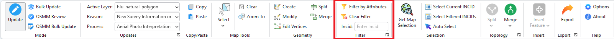

	HLU Tool Ribbon - Filter Group

The **Filter** group provides controls for filtering the INCID records displayed in the dockpane. It contains the following controls:

|filterbyattr| Filter by Attributes
------------------------------------

Opens the query builder, allowing users to filter INCID records based on non-spatial or complex attribute criteria. Only INCIDs matching the filter will be available via the record selectors in the dockpane.

.. seealso::
	See :ref:`advanced_query_builder_window` for more information.

|clearfilter| Clear Filter
--------------------------

Clears the current INCID filter so that all records are available for viewing using the record selectors.

Find Incid
----------

A text box for filtering the records to a single INCID. Enter an INCID value in the format ``nnnn:nnnnnnn`` and press :kbd:`Enter` to apply the filter.

.. seealso::
	See :ref:`filter_by_incid_window` for more information.

.. raw:: latex

	\newpage

.. index::
	single: Toolbar; Selection Group
	see: Selection Group; Toolbar

.. _selection_group:

Selection Group
===============

.. _figUIGSelection:

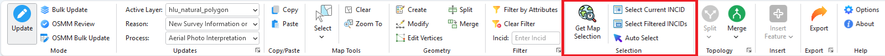

	HLU Tool Ribbon - Selection Group

The **Selection** group provides controls for selecting features on the map based on the INCID filter and vice versa. It contains the following buttons:

|getmapselection| Get Map Selection
------------------------------------

Filters the database records to retrieve the attributes associated with the features currently selected in the active HLU layer in ArcGIS Pro.

.. tip::
	Select one or more features on the map and click **Get Map Selection** to load only the INCID records associated with those features. The INCID records can then be browsed using the record selectors in the dockpane. The number of selected features for the current INCID is shown in the INCID status area. Click **Select Current INCID** to expand the selection to include all features belonging to the current INCID.

|selectonmap| Select Current INCID
-----------------------------------

Selects **all** of the features associated with only the **current** INCID record in the active HLU layer.

|selectallonmap| Select All Filtered INCIDs
--------------------------------------------

Selects **all** of the features associated with **all** currently filtered INCID records in the active HLU layer.

.. warning::
	This process may take a long time depending upon the number of currently filtered INCID records and the size of the HLU layer.

|autoselect| Auto Select
------------------------

Toggles automatic selection of all features associated with the current INCID record in the active HLU layer whenever the INCID changes in the dockpane.

.. raw:: latex

	\newpage

.. index::
	single: Toolbar; Topology Group
	see: Topology Group; Toolbar

.. _topology_group:

Topology Group
==============

.. _figUIGTopology:

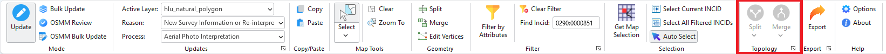

	HLU Tool Ribbon - Topology Group

.. note::
	All buttons in this group are disabled until database records have been filtered and a **Reason** and **Process** have been selected in the **Updates** group. For details see :ref:`updates_group`.

The **Topology** group contains two drop-down menus:

|split| Split
-------------

Opens the **Split** drop-down menu, which contains:

.. _physical_split_button:

|physicalsplit| Physical Split
	Sub-divides a single feature, that has already been split in the ArcGIS Pro map using the **Split** tool in the :ref:`geometry_group`, into one or more new fragments in the database by assigning new fragment identifiers. The fragments can then be assigned different attributes once they have been logically split from one another.

	.. note::
		Not available for point layers.

	.. seealso::
		See :ref:`physical_split` for more information.

|logicalsplit| Logical Split
	Splits one or more features from the current INCID into a new INCID so that they can be updated independently of the remaining features in the original INCID.

	.. seealso::
		See :ref:`logical_split` for more information.

|merge| Merge
-------------

Opens the **Merge** drop-down menu, which contains:

|physicalmerge| Physical Merge
	Combines two or more fragments of a single feature, that are associated with the same INCID, into a single merged feature in the ArcGIS Pro map and assigns them to the same fragment identifier.

	.. note::
		Not available for point layers.

	.. seealso::
		See :ref:`physical_merge` for more information.

|logicalmerge| Logical Merge
	Combines features selected in the map into the INCID of one of the selected features (chosen from the list of INCIDs presented during the process).

	.. seealso::
		See :ref:`logical_merge` for more information.

.. raw:: latex

	\newpage

.. index::
	single: Toolbar; Feature Insert Group
	see: Feature Insert Group; Toolbar

.. _feature_insert_group:

Feature Insert Group
====================

.. _figUIGFeatureInsert:

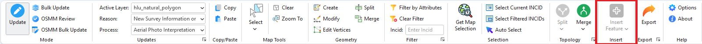

	HLU Tool Ribbon - Feature Insert Group

.. note::
	All buttons in this group are disabled until a **Reason** and **Process** have been selected in the **Updates** group and the selected features have no INCID assigned. For details see :ref:`updates_group`.

|insertfeature| Insert Feature
------------------------------

Opens the **Insert Feature** drop-down menu, which contains:

|insertfeaturesameincid| Same INCID
	Registers all currently selected new features (features with no INCID assigned) under a single new INCID. Use this when the drawn features represent multiple fragments of the same habitat record.

	.. seealso::
		See :ref:`function_insert_feature_same_incid` for more information.

|insertfeatureseparateincid| Separate INCIDs
	Registers each currently selected new feature under its own individual new INCID. Use this when each drawn feature represents a distinct, independent habitat record.

	.. seealso::
		See :ref:`function_insert_feature_separate_incids` for more information.

.. raw:: latex

	\newpage

.. index::
	single: Toolbar; Bulk Load/Unload Group
	see: Bulk Load/Unload Group; Toolbar

.. _bulk_load_unload_group:

Bulk Load/Unload Group
======================

.. _figUIGBulkLoadUnload:

.. figure:: figures/ToolbarBulkLoadUnloadGroup.png
	:align: center

	HLU Tool Ribbon - Bulk Load/Unload Group

The **Bulk Load/Unload** group provides functions for bulk unloading and loading OSMM features.

|bulkload| Bulk Load
-------------------

Opens the **Bulk Load/Unload** drop-down menu, which contains:

|bulkunload| Bulk Unload
	Removes selected registered features from the active HLU layer and cleans up their database records. Use this to unload features that were incorrectly loaded or will be replaced during a bulk load operation.

	.. seealso::
		See :ref:`bulk_unload_function` for more information.

|bulkload| Bulk Load
	Registers new features against new INCIDs using OSMM attributes matched against the OSMM cross-reference table. Each feature is assigned its own INCID based on habitat codes derived from OSMM descriptive attributes.

	.. seealso::
		See :ref:`bulk_load_function` for more information.

.. raw:: latex

	\newpage

.. index::
	single: Toolbar; Reassign Group
	see: Reassign Group; Toolbar

.. _reassign_group:

Reassign Group
==============

.. _figUIGReassign:

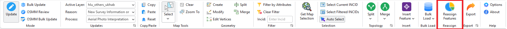

	HLU Tool Ribbon - Reassign Group

|reassign| Reassign Features
----------------------------

Opens the Reassign Features window, allowing users to move features from the active HLU layer to one or more target HLU layers based on configurable rules.

.. note::
	* Available only when **Update** mode is active.
	* The active HLU layer and all target layers must be editable in ArcGIS Pro.
	* Reassign rules are configured in the application options (see :ref:`options_reassign`).

.. seealso::
	See :ref:`reassign_features_function` for more information.

.. raw:: latex

	\newpage

.. index::
	single: Toolbar; Export Group
	see: Export Group; Toolbar

.. _export_group:

Export Group
============

.. _figUIGExport:

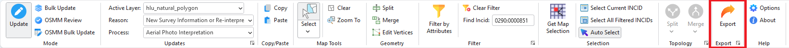

	HLU Tool Ribbon - Export Group

|export| Export
---------------

Opens the Export window, allowing users to export data from the HLU database to a GIS layer using a pre-defined export format.

.. note::
	Available only when **Update** mode is active.

.. seealso::
	See :ref:`export_window` and :ref:`export_function` for more information.

.. raw:: latex

	\newpage

.. index::
	single: Toolbar; Help Group
	see: Help Group; Toolbar

.. _help_group:

Help Group
==========

.. _figUIGInfo:

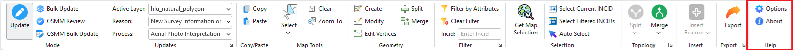

	HLU Tool Ribbon - Help Group

The **Help** group provides access to tool configuration and version information:

|options| Options
-----------------

Opens the Options window, allowing users to configure many aspects of the HLU Tool to suit their own requirements.

.. seealso::
	See :ref:`options_window` for more information.

|about| About
-------------

Displays information about the HLU Tool, including:

	* Current application and database versions
	* Current database connection details
	* Current user id and name
	* Copyright statements
	* Links to the online User and Technical Guides
